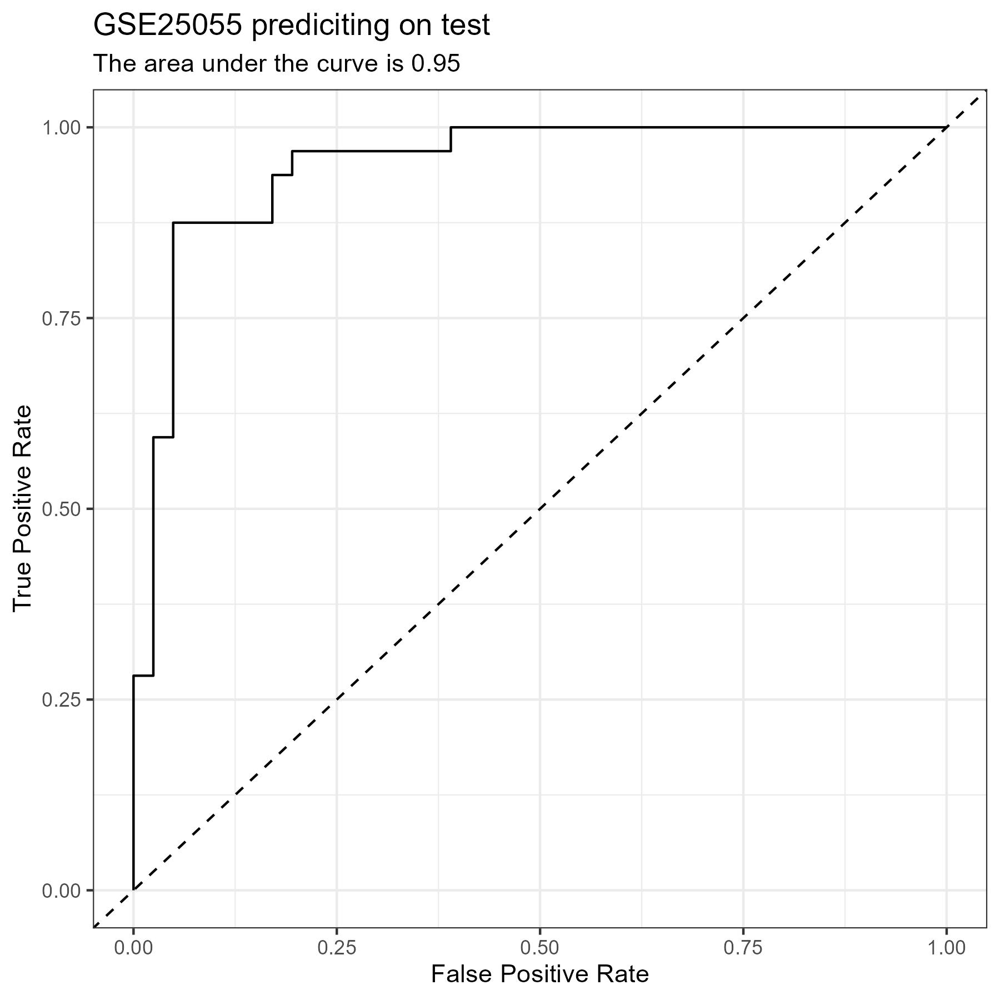
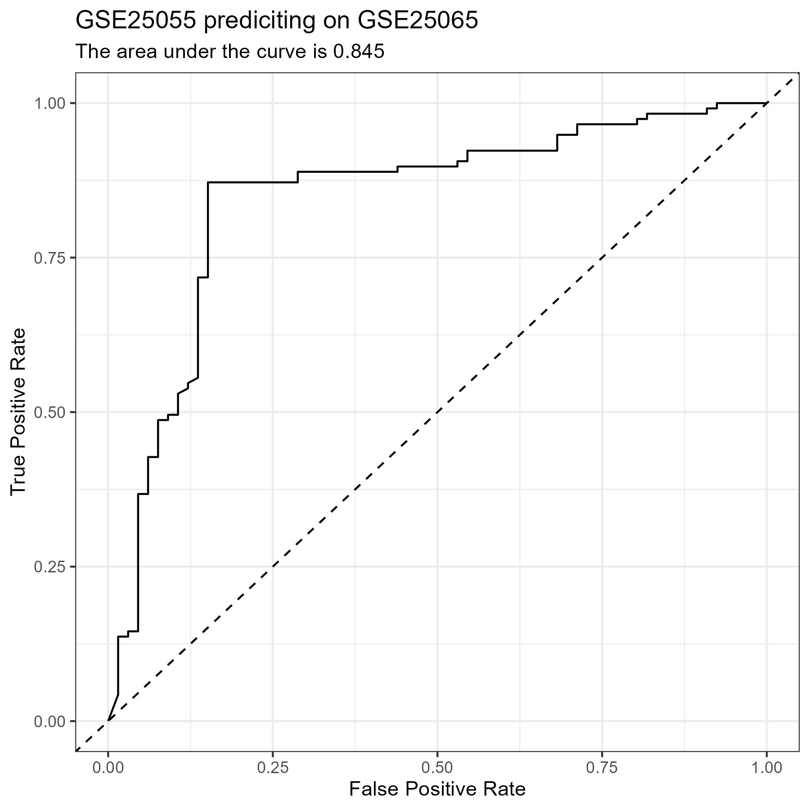
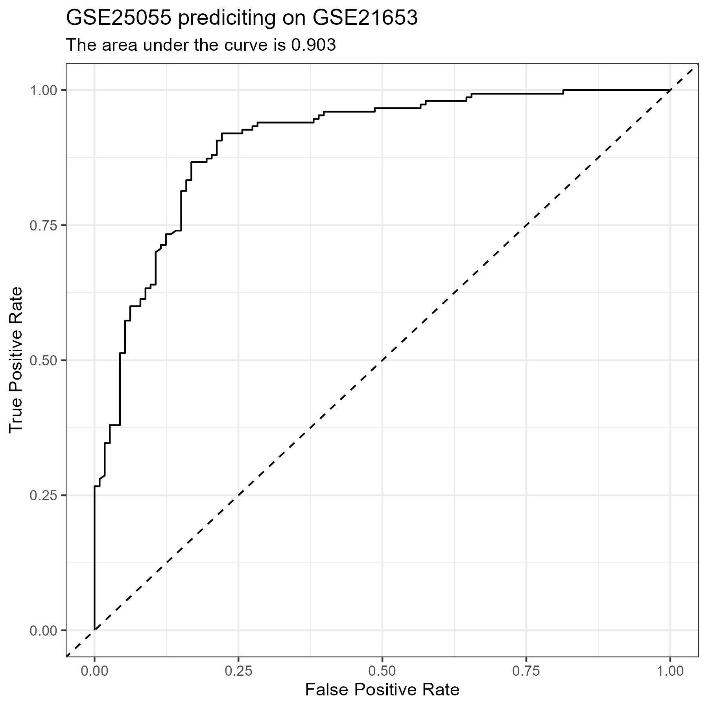
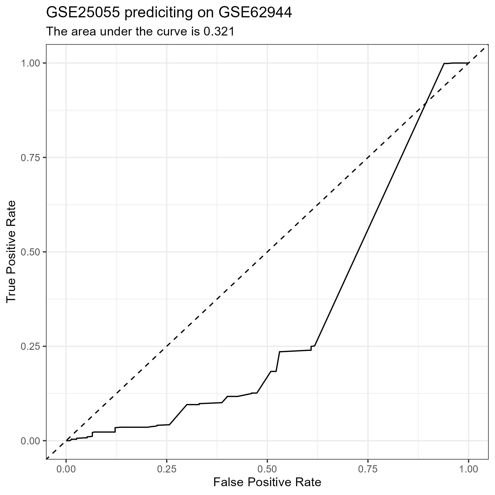
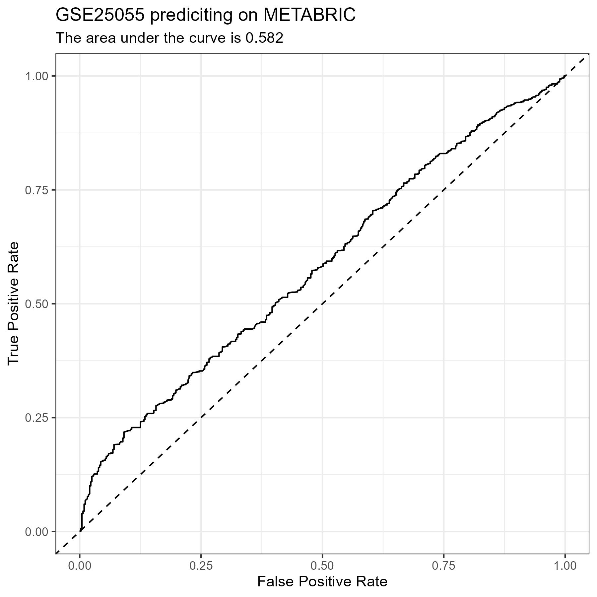

# More CPF Testing

- This update contains the results from the [CPF Reduced Script](../scripts/04_CPF_Reduced.R)
- It is very similar to the [CPF Range Script](../scripts/01_CPF_Range.R), so I will not be walking through the code, but rather showing the results of it.
- The only difference is that I am using a subset of 100 genes from the [shared gene set](../variables/genes.txt)
- I am just using one data set from each platform as my test data sets
    - <i>GSE25055</i> -> Training Set
        - See the [**Confusion Matrix**](#matrix-1), [**Metrics**](#metrics-1), and [**ROC Curve**](#plot-1) for the test set of this data below.
    - <i>GSE25065</i> -> Affymetrix Human Genome U133A Array
        - See the [**Confusion Matrix**](#matrix-2), [**Metrics**](#metrics-2), and [**ROC Curve**](#plot-2) for this data set below.
    - <i>GSE21653</i> -> Affymetrix Human Genome U133 Plus 2.0 Array
        - See the [**Confusion Matrix**](#matrix-3), [**Metrics**](#metrics-3), and [**ROC Curve**](#plot-3) for the test set of this data below.
    - <i>GSE58644</i> -> Affymetrix Human Gene 1.0 ST Array
        - See the [**Confusion Matrix**](#matrix-4), [**Metrics**](#metrics-4), and [**ROC Curve**](#plot-4) for the test set of this data below.
    - <i>GSE62944</i> -> Illumina Genome Analyzer
        - See the [**Confusion Matrix**](#matrix-5), [**Metrics**](#metrics-5), and [**ROC Curve**](#plot-5) for the test set of this data below.
    - <i>GSE81538</i> -> Illumina HiSeq 2000
        - See the [**Confusion Matrix**](#matrix-6), [**Metrics**](#metrics-6), and [**ROC Curve**](#plot-6) for the test set of this data below.
    - <i>METABRIC</i> -> Illumina Human HT-12 v3 Expression Beadchips
        - See the [**Confusion Matrix**](#matrix-7), [**Metrics**](#metrics-7), and [**ROC Curve**](#plot-7) for the test set of this data below.
    - <i>GSE96058N</i> -> Illumina NextSeq 500
        - See the [**Confusion Matrix**](#matrix-8), [**Metrics**](#metrics-8), and [**ROC Curve**](#plot-8) for the test set of this data below.

# Results

#### test Confusion Matrix {#matrix-1} 

|   Predicted/Actual    |   +   |   -   |
| :-------------------: | :---: | :---: |
|           +           |  28  |  3  |
|           -           |  4  |  38  |

#### test Metrics {#metrics-1} 

- Accuracy:     0.904 
- Precision:    0.903 
- Recall:       0.875 
- Specificity:  0.927 

#### GSE25065 Confusion Matrix {#matrix-2} 

|   Predicted/Actual    |   +   |   -   |
| :-------------------: | :---: | :---: |
|           +           |  102  |  14  |
|           -           |  15  |  52  |

#### GSE25065 Metrics {#metrics-2} 

- Accuracy:     0.842 
- Precision:    0.879 
- Recall:       0.872 
- Specificity:  0.788 

#### GSE21653 Confusion Matrix {#matrix-3} 

|   Predicted/Actual    |   +   |   -   |
| :-------------------: | :---: | :---: |
|           +           |  142  |  44  |
|           -           |  8  |  69  |

#### GSE21653 Metrics {#metrics-3} 

- Accuracy:     0.802 
- Precision:    0.763 
- Recall:       0.947 
- Specificity:  0.611 

#### GSE58644 Confusion Matrix {#matrix-4} 

|   Predicted/Actual    |   +   |   -   |
| :-------------------: | :---: | :---: |
|           +           |  225  |  23  |
|           -           |  25  |  47  |

#### GSE58644 Metrics {#metrics-4} 

- Accuracy:     0.85 
- Precision:    0.907 
- Recall:       0.9 
- Specificity:  0.671 

#### GSE62944 Confusion Matrix {#matrix-5} 

|   Predicted/Actual    |   +   |   -   |
| :-------------------: | :---: | :---: |
|           +           |  3  |  6  |
|           -           |  782  |  224  |

#### GSE62944 Metrics {#metrics-5} 

- Accuracy:     0.224 
- Precision:    0.333 
- Recall:       0.004 
- Specificity:  0.974 

#### GSE81538 Confusion Matrix {#matrix-6} 

|   Predicted/Actual    |   +   |   -   |
| :-------------------: | :---: | :---: |
|           +           |  4  |  21  |
|           -           |  78  |  294  |

#### GSE81538 Metrics {#metrics-6} 

- Accuracy:     0.751 
- Precision:    0.16 
- Recall:       0.049 
- Specificity:  0.933 

#### METABRIC Confusion Matrix {#matrix-7} 

|   Predicted/Actual    |   +   |   -   |
| :-------------------: | :---: | :---: |
|           +           |  1429  |  410  |
|           -           |  69  |  29  |

#### METABRIC Metrics {#metrics-7} 

- Accuracy:     0.753 
- Precision:    0.777 
- Recall:       0.954 
- Specificity:  0.066 

#### GSE96058N Confusion Matrix {#matrix-8} 

|   Predicted/Actual    |   +   |   -   |
| :-------------------: | :---: | :---: |
|           +           |  31  |  3  |
|           -           |  232  |  24  |

#### GSE96058N Metrics {#metrics-8} 

- Accuracy:     0.19 
- Precision:    0.912 
- Recall:       0.118 
- Specificity:  0.889 

# Figures

{#plot-1 width=100%}

{#plot-2 width=100%}

{#plot-3 width=100%}

{#plot-4 width=100%}

{#plot-5 width=100%}

{#plot-6 width=100%}

{#plot-7 width=100%}

{#plot-8 width=100%}

