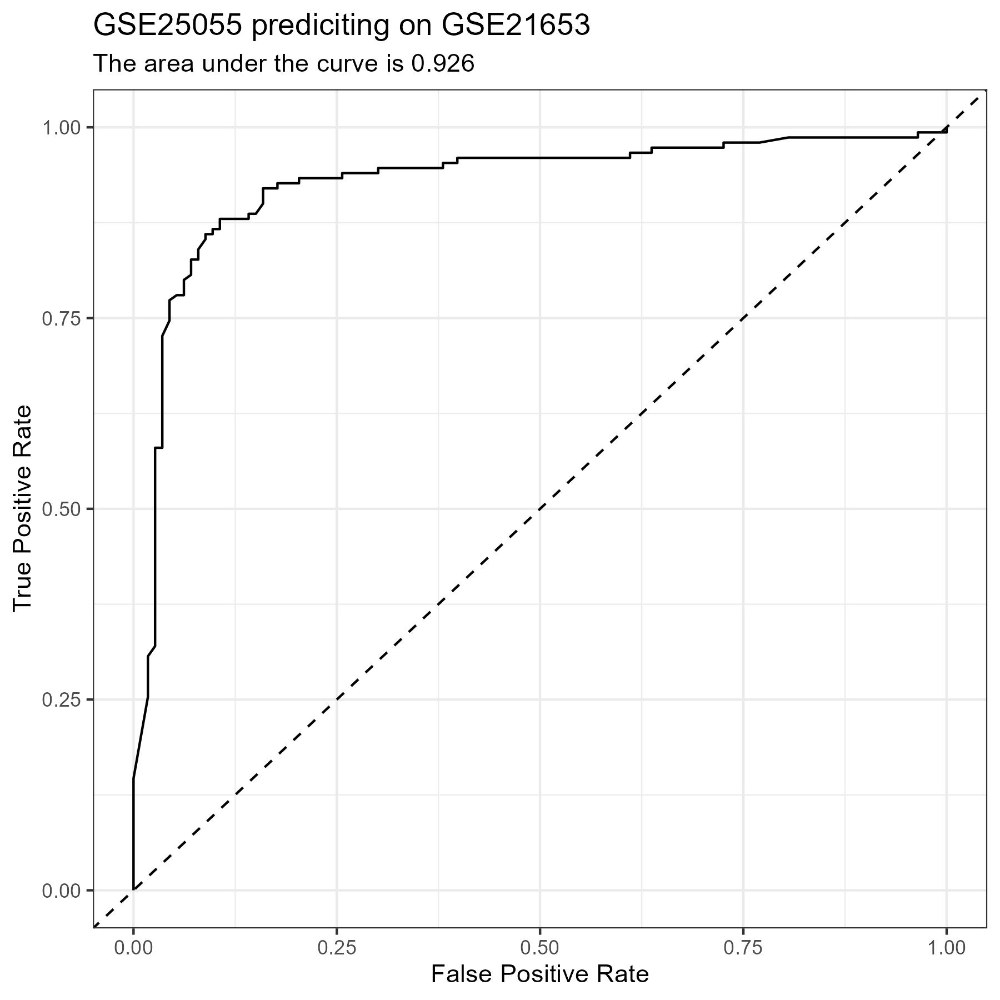
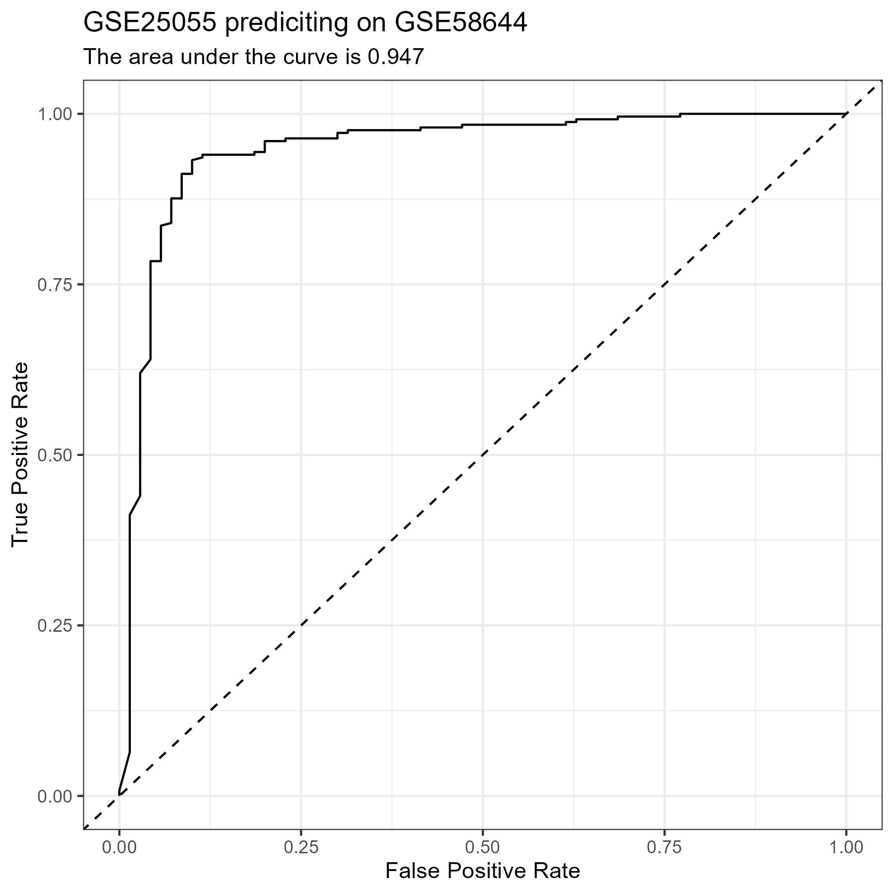
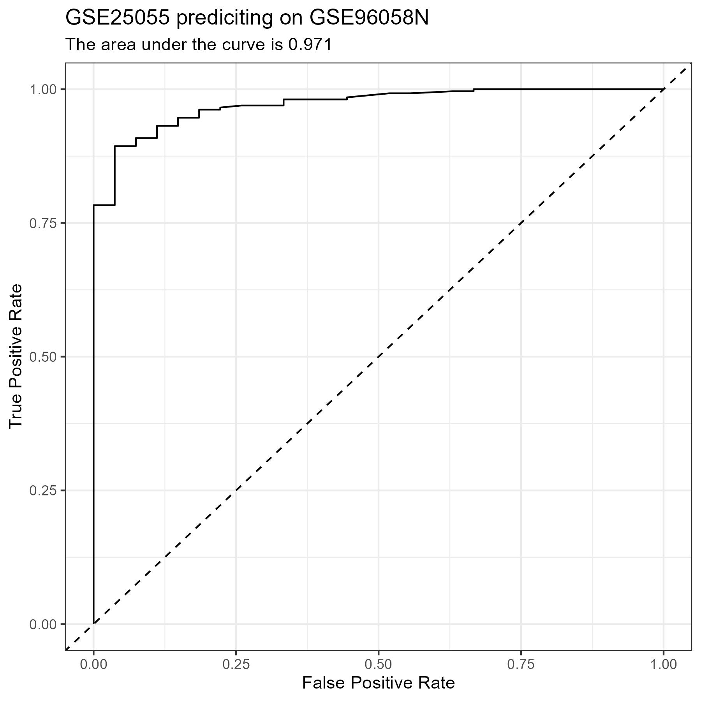

# Cross-Platform Model Testing

- These notes explain what is happening in the [CPF Normalize Each script](../scripts/05_CPF_Normalize_Each.R)
1. [Loading the Functions and Libraries](#part-1)
2. [Reading in the Data](#part-2)
3. [Preparing the Recipe](#part-3)
4. [Preparing the Model](#part-4)
5. [Obtaining Predictions](#part-5)
6. [Results](#results)
7. [Figures](#figures)


## Loading the Functions {#part-1}
<!--{-->

- I start by loading in the functions that I will need during the analysis
    - `readFiles()`
    - `bakeFiles()`
    - `mdMetrics()`
    - `rocCurve()`
- I also load the libraries that I will need in this analysis
    - `tidymodels`
    - `tidyverse`

```{r}
source("../functions/readFiles.R")
source("../functions/bakeFiles.R")
source("../functions/mdMetrics.R")
source("../functions/rocCurve.R")
library(tidymodels)
library(tidyverse)
```

<!--}-->


## Reading in the Data {#part-2}
<!--{-->

- Read in the common genes
- Read in the data sets that I am going to use in the analysis using the `readFiles()` [function](../functions/readFiles.R):
    - I am just using one data set from each platform as my test data sets
        - <i>GSE25055</i> -> Training Set
            - See the [**Confusion Matrix**](#matrix-1), [**Metrics**](#metrics-1), and [**ROC Curve**](#plot-1) for the test set of this data below.
        - <i>GSE25065</i> -> Affymetrix Human Genome U133A Array
            - See the [**Confusion Matrix**](#matrix-2), [**Metrics**](#metrics-2), and [**ROC Curve**](#plot-2) for this data set below.
        - <i>GSE21653</i> -> Affymetrix Human Genome U133 Plus 2.0 Array
            - See the [**Confusion Matrix**](#matrix-3), [**Metrics**](#metrics-3), and [**ROC Curve**](#plot-3) for the test set of this data below.
        - <i>GSE58644</i> -> Affymetrix Human Gene 1.0 ST Array
            - See the [**Confusion Matrix**](#matrix-4), [**Metrics**](#metrics-4), and [**ROC Curve**](#plot-4) for the test set of this data below.
        - <i>GSE62944</i> -> Illumina Genome Analyzer
            - See the [**Confusion Matrix**](#matrix-5), [**Metrics**](#metrics-5), and [**ROC Curve**](#plot-5) for the test set of this data below.
        - <i>GSE81538</i> -> Illumina HiSeq 2000
            - See the [**Confusion Matrix**](#matrix-6), [**Metrics**](#metrics-6), and [**ROC Curve**](#plot-6) for the test set of this data below.
        - <i>METABRIC</i> -> Illumina Human HT-12 v3 Expression Beadchips
            - See the [**Confusion Matrix**](#matrix-7), [**Metrics**](#metrics-7), and [**ROC Curve**](#plot-7) for the test set of this data below.
        - <i>GSE96058N</i> -> Illumina NextSeq 500
            - See the [**Confusion Matrix**](#matrix-8), [**Metrics**](#metrics-8), and [**ROC Curve**](#plot-8) for the test set of this data below.

```{r}
dataSets = c("GSE25065",
             "GSE21653",
             "GSE58644",
             "GSE62944",
             "GSE81538",
             "METABRIC",
             "GSE96058N")

genes = readLines("variables/genes.txt")

readFiles("GSE25055", columns = c("Class", genes))
readFiles(dataSets, columns = c("Class", genes))

dataSets = c("test", dataSets)
```

<!--}-->


## Preparing the Recipe {#part-3}
<!--{-->

- Split the <i>GSE25055</i> data into training and testing subsets (75/25)
- Create the formula for later use
- Create a recipe for each individual data set to do the following:
    - Normalize the data ( making $\mu = 0$ and $\sigma = 1$ )
- Save the recipes to the [CPF Normalize Each folder](../recipes/05_CPF_Normalize_Each/)

```{r}
set.seed(42)
split = initial_split(GSE25055, prop = 0.75)
train = training(split)
test = testing(split)

formula = Class ~ .

subFolder = "05_CPF_Normalize_Each/"
if(!dir.exists(paste0("baked/", subFolder))) dir.create(paste0("baked/", subFolder))
if(!dir.exists(paste0("plots/", subFolder))) dir.create(paste0("plots/", subFolder))
if(!dir.exists(paste0("recipes/", subFolder))) dir.create(paste0("recipes/", subFolder))

recipe = recipe(formula, data = train) |>
    step_normalize(all_predictors()) |>
    step_mutate(Class = as.factor(Class)) |>
    prep(training = train)

train = bake(recipe, new_data = NULL)
write_tsv(train, paste0("baked/", subFolder, "train.tsv"))
saveRDS(recipe, paste0("recipes/", subFolder, "train.rds"))

dataSetVariables = mget(dataSets)

i = 1
for(dataSet in dataSetVariables) {
   cat("  Recipe for ", dataSets[i], "\t(", i, "/", length(dataSets), ")\n")
   recipe = recipe(formula, data = dataSet) |>
      step_normalize(all_predictors()) |>
      step_mutate(Class = as.factor(Class)) |>
      prep(training = dataSet)
   eval(expr(!!sym(dataSets[i]) <<- bake(recipe, new_data = NULL)))
   write_tsv(dataSet, paste0("baked/", subFolder, dataSets[i], ".tsv"))
   saveRDS(recipe, paste0("recipes/", subFolder, dataSets[i], ".rds"))
   cat("\b    Done\n")
   i = i + 1
}
```

<!--}-->


## Preparing the Model {#part-4}
<!--{-->

- I am going to be using the same model that I chose in the other analyses that I have done
- Set up the model with the following details:
    - Use 25 trees
    - Use the engine ranger
    - Use a classification mode
- Train the model on the training data
- Save the model

```{r}
set.seed(42)
model = rand_forest(trees = 25,
                    mode = "classification",
                    engine = "ranger")

fitModel = model |>
            fit(formula, data = train)

saveRDS(fitModel, "models/05_CPF_Normalize_Each.rds")
```

<!--}-->


## Obtaining Predictions {#part-5}
<!--{-->

- Make predictions for each set of test data from the different platforms
- Obtain the metrics for each set of predictions using the `mdMetrics()` [function](../functions/mdMetrics.R)
    - I make it print out the MD formatted metrics (`mdOutput = TRUE`)
    - I do not have it return the actual metrics (`output = FALSE`)
- Create a ROC curve for each data set using the `rocCurve()` [function](../functions/rocCurve.R)
    - I make it print out the MD formatted plot (`plotOutput = TRUE`)
    - I do not make it output the area under the curve metrics (`output = TRUE`)

```{r}
i = 1
for(dataSet in dataSetVariables) {
    setName = dataSets[i]
    mdMetrics(fitModel,
              dataSet,
              setName = setName,
              num = i)
    i = i + 1
}

i = 1
for(dataSet in dataSetVariables) {
    setName = dataSets[i]
    rocCurve(fitModel,
             dataSet,
             filename = setName,
             folder = paste0("plots/", subFolder),
             subtitle = paste0("GSE25055 prediciting on ", setName),
             num = i,
             plot = FALSE)
    i = i + 1
}
```

<!--}-->


## Results {#results}
<!--{-->

#### test Confusion Matrix {#matrix-1} 

|   Predicted/Actual    |   +   |   -   |
| :-------------------: | :---: | :---: |
|           +           |  32  |  6  |
|           -           |  0  |  35  |

#### test Metrics {#metrics-1} 

- Accuracy:     0.918 
- Precision:    0.842 
- Recall:       1 
- Specificity:  0.854 

#### GSE25065 Confusion Matrix {#matrix-2} 

|   Predicted/Actual    |   +   |   -   |
| :-------------------: | :---: | :---: |
|           +           |  100  |  17  |
|           -           |  17  |  49  |

#### GSE25065 Metrics {#metrics-2} 

- Accuracy:     0.814 
- Precision:    0.855 
- Recall:       0.855 
- Specificity:  0.742 

#### GSE21653 Confusion Matrix {#matrix-3} 

|   Predicted/Actual    |   +   |   -   |
| :-------------------: | :---: | :---: |
|           +           |  142  |  37  |
|           -           |  8  |  76  |

#### GSE21653 Metrics {#metrics-3} 

- Accuracy:     0.829 
- Precision:    0.793 
- Recall:       0.947 
- Specificity:  0.673 

#### GSE58644 Confusion Matrix {#matrix-4} 

|   Predicted/Actual    |   +   |   -   |
| :-------------------: | :---: | :---: |
|           +           |  235  |  10  |
|           -           |  15  |  60  |

#### GSE58644 Metrics {#metrics-4} 

- Accuracy:     0.922 
- Precision:    0.959 
- Recall:       0.94 
- Specificity:  0.857 

#### GSE62944 Confusion Matrix {#matrix-5} 

|   Predicted/Actual    |   +   |   -   |
| :-------------------: | :---: | :---: |
|           +           |  733  |  32  |
|           -           |  52  |  198  |

#### GSE62944 Metrics {#metrics-5} 

- Accuracy:     0.917 
- Precision:    0.958 
- Recall:       0.934 
- Specificity:  0.861 

#### GSE81538 Confusion Matrix {#matrix-6} 

|   Predicted/Actual    |   +   |   -   |
| :-------------------: | :---: | :---: |
|           +           |  12  |  296  |
|           -           |  70  |  19  |

#### GSE81538 Metrics {#metrics-6} 

- Accuracy:     0.078 
- Precision:    0.039 
- Recall:       0.146 
- Specificity:  0.06 

#### METABRIC Confusion Matrix {#matrix-7} 

|   Predicted/Actual    |   +   |   -   |
| :-------------------: | :---: | :---: |
|           +           |  1373  |  87  |
|           -           |  125  |  352  |

#### METABRIC Metrics {#metrics-7} 

- Accuracy:     0.891 
- Precision:    0.94 
- Recall:       0.917 
- Specificity:  0.802 

#### GSE96058N Confusion Matrix {#matrix-8} 

|   Predicted/Actual    |   +   |   -   |
| :-------------------: | :---: | :---: |
|           +           |  223  |  1  |
|           -           |  40  |  26  |

#### GSE96058N Metrics {#metrics-8} 

- Accuracy:     0.859 
- Precision:    0.996 
- Recall:       0.848 
- Specificity:  0.963 

<!--}-->


## Figures {#figures}
<!--{-->

{#plot-1 width=100%}

{#plot-2 width=100%}

{#plot-3 width=100%}

{#plot-4 width=100%}

{#plot-5 width=100%}

{#plot-6 width=100%}

{#plot-7 width=100%}

{#plot-8 width=100%}

<!--}-->


