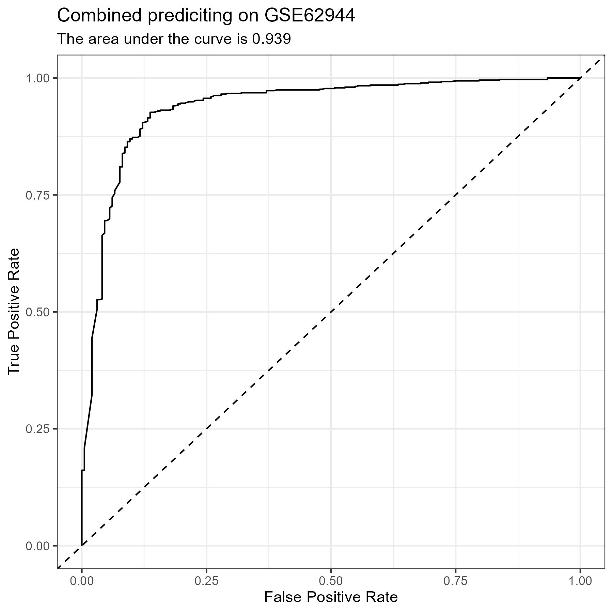
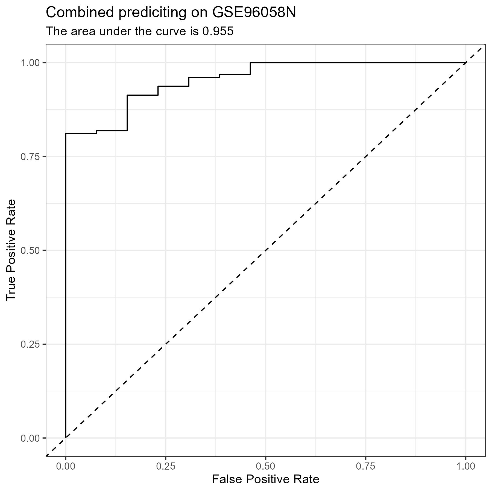

# Cross-Platform Model Testing

- These notes explain what is happening in the [CPF Platform script](../scripts/07_CPF_Platform.R)
1. [Loading the Functions and Libraries](#part-1)
2. [Preparing the Data](#part-2)
3. [Preparing the Recipe](#part-3)
4. [Preparing the Model](#part-4)
5. [Obtaining Predictions](#part-5)
6. [Results](#results)
7. [Figures](#figures)


## Loading the Functions {#part-1}
<!--{-->

- I start by loading in the functions that I will need during the analysis
    - `readFiles()`
    - `bakeFiles()`
    - `mdMetrics()`
    - `rocCurve()`
- I also load the libraries that I will need in this analysis
    - `tidymodels`
    - `tidyverse`

```R
source("../functions/readFiles.R")
source("../functions/bakeFiles.R")
source("../functions/mdMetrics.R")
source("../functions/rocCurve.R")
library(tidymodels)
library(tidyverse)
```

<!--}-->


## Preparing the Data {#part-2}
<!--{-->

- Read in the common genes
- Read in the data sets that I am going to use in the analysis using the `readFiles()` [function](../functions/readFiles.R):
    - I am just using one data set from each platform to create my training data set
    - The leftover data from each set will become its own test set
        - <i>GSE25055</i> -> Affymetrix Human Genome U133A Array
            - [Confusion Matrix](#matrix-1)
            - [Metrics](#metrics-1)
            - [ROC Curve](#plot-1)
        - <i>GSE31448</i> -> Affymetrix Human Genome U133 Plus 2.0 Array
            - [Confusion Matrix](#matrix-2)
            - [Metrics](#metrics-2)
            - [ROC Curve](#plot-2)
        - <i>GSE58644</i> -> Affymetrix Human Gene 1.0 ST Array
            - [Confusion Matrix](#matrix-3)
            - [Metrics](#metrics-3)
            - [ROC Curve](#plot-3)
        - <i>GSE62944</i> -> Illumina Genome Analyzer
            - [Confusion Matrix](#matrix-4)
            - [Metrics](#metrics-4)
            - [ROC Curve](#plot-4)
        - <i>GSE81538</i> -> Illumina HiSeq 2000
            - [Confusion Matrix](#matrix-5)
            - [Metrics](#metrics-5)
            - [ROC Curve](#plot-5)
        - <i>METABRIC</i> -> Illumina Human HT-12 v3 Expression Beadchips
            - [Confusion Matrix](#matrix-6)
            - [Metrics](#metrics-6)
            - [ROC Curve](#plot-6)
        - <i>GSE96058N</i> -> Illumina NextSeq 500
            - [Confusion Matrix](#matrix-9)
            - [Metrics](#metrics-9)
            - [ROC Curve](#plot-9)
    - In addition, these data sets will serve as test sets
        - <i>GSE25065</i> -> Affymetrix Human Genome U133A Array
            - [Confusion Matrix](#matrix-7)
            - [Metrics](#metrics-7)
            - [ROC Curve](#plot-7)
        - <i>GSE21653</i> -> Affymetrix Human Genome U133 Plus 2.0 Array
            - [Confusion Matrix](#matrix-8)
            - [Metrics](#metrics-8)
            - [ROC Curve](#plot-8)
- Add the platform to each data set in a new column as a `factor`

```R
dataSets = c("GSE25055",
             "GSE31448",
             "GSE58644",
             "GSE62944",
             "GSE81538",
             "METABRIC",
             "GSE96058N")
platforms = factor(c("AHGUA",
                     "AHGUP2A",
                     "AHG1SA",
                     "IGA",
                     "IHS2",
                     "IHHTEB",
                     "INS5"))
testSets = c("GSE25065",
             "GSE21653")
testPlatforms = c("AHGUA",
                  "AHGUP2A")

genes = readLines("variables/genes.txt")

readFiles(dataSets, columns = c("Class", genes))
readFiles(testSets, columns = c("Class", genes))

dataSetVariables = mget(dataSets)
testSetVariables = mget(testSets)

i = 1
for(dataSet in dataSetVariables) {
   dataSet$Platform = platforms[i]
   i = i + 1
}
i = 1
for(testSet in testSetVariables) {
   testSet$Platform = testPlatforms[i]
   i = i + 1
}
```

<!--}-->


## Preparing the Recipe {#part-3}
<!--{-->

- I prepare the training data by taking 150 samples from the 6 different data sets.
- The leftover samples from each of the data sets used for training is then added to the test sets
- I create the folders to hold the data and plots that will be produced later
- I am using normal standardization on the training data in the recipe as that showed the most promise when training only on <i>GSE25055</i>.
- I save the recipe

```R
set.seed(42)
split = initial_split(GSE25055, prop = 150/nrow(GSE25055), strata = Class)
train = training(split)
GSE25055 = anti_join(GSE25055, train)
i = 1
for(dataSet in dataSetVariables) {
   split = initial_split(dataSet, prop = 150/nrow(dataSet), strata = Class)
   train = bind_rows(train, training(split))
   eval(expr(!!sym(dataSets[i]) <<- anti_join(dataSet, train)))
   i = i + 1
}

testSets = c(dataSets, testSets)

formula = Class ~ .

subFolder = "07_CPF_Combined_Platform/"
if(!dir.exists(paste0("baked/", subFolder))) dir.create(paste0("baked/", subFolder))
if(!dir.exists(paste0("plots/", subFolder))) dir.create(paste0("plots/", subFolder))

recipe = recipe(formula, data = train) |>
    step_normalize(all_numeric_predictors()) |>
    step_mutate(Class = as.factor(Class)) |>
    prep(training = train)

train = bake(recipe, new_data = NULL)
write_tsv(train, paste0("baked/", subFolder, "train.tsv"))

bakeFiles(testSets, recipe, subFolder)

saveRDS(recipe, "recipes/07_CPF_Combined_Platform.rds")
```

<!--}-->


## Preparing the Model {#part-4}
<!--{-->

- I use a random forest model with the following details:
    - The engine is `ranger`
    - The mode is `classification`
    - The number of trees is `35`
        - I have used 25 in the past. With more diverse data, I feel more trees would be better.
- I fit the model on the combined training set

```R
set.seed(42)
model = rand_forest(trees = 35,
                    mode = "classification",
                    engine = "ranger")

fitModel = model |>
            fit(formula, data = train)

saveRDS(fitModel, "models/07_CPF_Combined_Platform.rds")
```

<!--}-->


## Obtaining Predictions {#part-5}
<!--{-->

- I obtain the metrics, confusion matrix, and ROC curve for each of the test sets using the [MD Metrics function](../functions/mdMetrics.R) and the [ROC Curve function](../functions/rocCurve.R)

```R
testSetVariables = mget(testSets)

i = 1
for(dataSet in testSetVariables) {
    setName = testSets[i]
    mdMetrics(fitModel,
              dataSet,
              setName = setName,
              num = i)
    i = i + 1
}

i = 1
for(dataSet in testSetVariables) {
    setName = testSets[i]
    rocCurve(fitModel,
             dataSet,
             filename = setName,
             folder = paste0("plots/", subFolder),
             title = "CPF Combined Platform",
             subtitle = paste0("Combined prediciting on ", setName),
             num = i,
             plot = FALSE)
    i = i + 1
}
```

<!--}-->


## Results {#results}
<!--{-->

#### GSE25055 Confusion Matrix {#matrix-1} 

|   Predicted/Actual    |   +   |   -   |
| :-------------------: | :---: | :---: |
|           +           |  34  |  2  |
|           -           |  2  |  26  |

#### GSE25055 Metrics {#metrics-1} 

- Accuracy:     0.938 
- Precision:    0.944 
- Recall:       0.944 
- Specificity:  0.929 

#### GSE31448 Confusion Matrix {#matrix-2} 

|   Predicted/Actual    |   +   |   -   |
| :-------------------: | :---: | :---: |
|           +           |  102  |  15  |
|           -           |  6  |  77  |

#### GSE31448 Metrics {#metrics-2} 

- Accuracy:     0.895 
- Precision:    0.872 
- Recall:       0.944 
- Specificity:  0.837 

#### GSE58644 Confusion Matrix {#matrix-3} 

|   Predicted/Actual    |   +   |   -   |
| :-------------------: | :---: | :---: |
|           +           |  130  |  13  |
|           -           |  3  |  25  |

#### GSE58644 Metrics {#metrics-3} 

- Accuracy:     0.906 
- Precision:    0.909 
- Recall:       0.977 
- Specificity:  0.658 

#### GSE62944 Confusion Matrix {#matrix-4} 

|   Predicted/Actual    |   +   |   -   |
| :-------------------: | :---: | :---: |
|           +           |  648  |  69  |
|           -           |  21  |  128  |

#### GSE62944 Metrics {#metrics-4} 

- Accuracy:     0.896 
- Precision:    0.904 
- Recall:       0.969 
- Specificity:  0.65 

#### GSE81538 Confusion Matrix {#matrix-5} 

|   Predicted/Actual    |   +   |   -   |
| :-------------------: | :---: | :---: |
|           +           |  27  |  2  |
|           -           |  25  |  194  |

#### GSE81538 Metrics {#metrics-5} 

- Accuracy:     0.891 
- Precision:    0.931 
- Recall:       0.519 
- Specificity:  0.99 

#### METABRIC Confusion Matrix {#matrix-6} 

|   Predicted/Actual    |   +   |   -   |
| :-------------------: | :---: | :---: |
|           +           |  1353  |  123  |
|           -           |  29  |  283  |

#### METABRIC Metrics {#metrics-6} 

- Accuracy:     0.915 
- Precision:    0.917 
- Recall:       0.979 
- Specificity:  0.697 

#### GSE96058N Confusion Matrix {#matrix-7} 

|   Predicted/Actual    |   +   |   -   |
| :-------------------: | :---: | :---: |
|           +           |  127  |  12  |
|           -           |  0  |  1  |

#### GSE96058N Metrics {#metrics-7} 

- Accuracy:     0.914 
- Precision:    0.914 
- Recall:       1 
- Specificity:  0.077 

#### GSE25065 Confusion Matrix {#matrix-8} 

|   Predicted/Actual    |   +   |   -   |
| :-------------------: | :---: | :---: |
|           +           |  100  |  14  |
|           -           |  17  |  52  |

#### GSE25065 Metrics {#metrics-8} 

- Accuracy:     0.831 
- Precision:    0.877 
- Recall:       0.855 
- Specificity:  0.788 

#### GSE21653 Confusion Matrix {#matrix-9} 

|   Predicted/Actual    |   +   |   -   |
| :-------------------: | :---: | :---: |
|           +           |  146  |  12  |
|           -           |  4  |  101  |

#### GSE21653 Metrics {#metrics-9} 

- Accuracy:     0.939 
- Precision:    0.924 
- Recall:       0.973 
- Specificity:  0.894 

<!--}-->


## Figures {#figures}
<!--{-->

{#plot-1 width=100%}

{#plot-2 width=100%}

{#plot-3 width=100%}

{#plot-4 width=100%}

{#plot-5 width=100%}

{#plot-6 width=100%}

{#plot-7 width=100%}

{#plot-8 width=100%}

{#plot-9 width=100%}

<!--}-->


