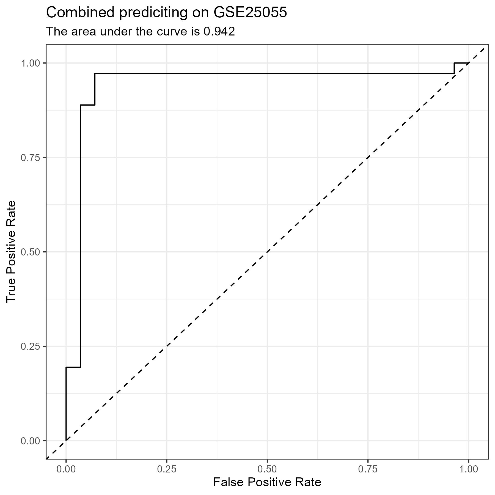

# More CPF Testing

- This update contains the results from the [CPF Combined Script](../scripts/08_CPF_Combined.R)
- It is very similar to the [CPF Combined Platform Script](../script/07_CPF_Combined_Platform.R), so I will not be walking through the code, but rather showing the results of it.
- The only difference is I am not using the platform as a feature in this script.
- I am just using one data set from each platform as my test data sets
    - <i>GSE25055</i> -> Affymetrix Human Genome U133A Array
        - See the [**Confusion Matrix**](#matrix-1), [**Metrics**](#metrics-1), and [**ROC Curve**](#plot-1) for this data below.
    - <i>GSE31448</i> -> Affymetrix Human Genome U133 Plus 2.0 Array
        - See the [**Confusion Matrix**](#matrix-2), [**Metrics**](#metrics-2), and [**ROC Curve**](#plot-2) for this data set below.
    - <i>GSE58644</i> -> Affymetrix Human Gene 1.0 ST Array
        - See the [**Confusion Matrix**](#matrix-3), [**Metrics**](#metrics-3), and [**ROC Curve**](#plot-3) for the test set of this data below.
    - <i>GSE62944</i> -> Illumina Genome Analyzer
        - See the [**Confusion Matrix**](#matrix-4), [**Metrics**](#metrics-4), and [**ROC Curve**](#plot-4) for the test set of this data below.
    - <i>GSE81538</i> -> Illumina HiSeq 2000
        - See the [**Confusion Matrix**](#matrix-5), [**Metrics**](#metrics-5), and [**ROC Curve**](#plot-5) for the test set of this data below.
    - <i>METABRIC</i> -> Illumina Human HT-12 v3 Expression Beadchips
        - See the [**Confusion Matrix**](#matrix-6), [**Metrics**](#metrics-6), and [**ROC Curve**](#plot-6) for the test set of this data below.
    - <i>GSE25065</i> -> Affymetrix Human Genome U133A Array
        - See the [**Confusion Matrix**](#matrix-7), [**Metrics**](#metrics-7), and [**ROC Curve**](#plot-7) for this data below.
    - <i>GSE21653</i> -> Affymetrix Human Genome U133 Plus 2.0 Array
        - See the [**Confusion Matrix**](#matrix-8), [**Metrics**](#metrics-8), and [**ROC Curve**](#plot-8) for this data below.
    - <i>GSE96058N</i> -> Illumina NextSeq 500
        - See the [**Confusion Matrix**](#matrix-9), [**Metrics**](#metrics-9), and [**ROC Curve**](#plot-9) for this data below.

# Results

#### GSE25055 Confusion Matrix {#matrix-1} 

|   Predicted/Actual    |   +   |   -   |
| :-------------------: | :---: | :---: |
|           +           |  34  |  2  |
|           -           |  2  |  26  |

#### GSE25055 Metrics {#metrics-1} 

- Accuracy:     0.938 
- Precision:    0.944 
- Recall:       0.944 
- Specificity:  0.929 

#### GSE31448 Confusion Matrix {#matrix-2} 

|   Predicted/Actual    |   +   |   -   |
| :-------------------: | :---: | :---: |
|           +           |  102  |  15  |
|           -           |  6  |  77  |

#### GSE31448 Metrics {#metrics-2} 

- Accuracy:     0.895 
- Precision:    0.872 
- Recall:       0.944 
- Specificity:  0.837 

#### GSE58644 Confusion Matrix {#matrix-3} 

|   Predicted/Actual    |   +   |   -   |
| :-------------------: | :---: | :---: |
|           +           |  130  |  13  |
|           -           |  3  |  25  |

#### GSE58644 Metrics {#metrics-3} 

- Accuracy:     0.906 
- Precision:    0.909 
- Recall:       0.977 
- Specificity:  0.658 

#### GSE62944 Confusion Matrix {#matrix-4} 

|   Predicted/Actual    |   +   |   -   |
| :-------------------: | :---: | :---: |
|           +           |  648  |  69  |
|           -           |  21  |  128  |

#### GSE62944 Metrics {#metrics-4} 

- Accuracy:     0.896 
- Precision:    0.904 
- Recall:       0.969 
- Specificity:  0.65 

#### GSE81538 Confusion Matrix {#matrix-5} 

|   Predicted/Actual    |   +   |   -   |
| :-------------------: | :---: | :---: |
|           +           |  27  |  2  |
|           -           |  25  |  194  |

#### GSE81538 Metrics {#metrics-5} 

- Accuracy:     0.891 
- Precision:    0.931 
- Recall:       0.519 
- Specificity:  0.99 

#### METABRIC Confusion Matrix {#matrix-6} 

|   Predicted/Actual    |   +   |   -   |
| :-------------------: | :---: | :---: |
|           +           |  1353  |  123  |
|           -           |  29  |  283  |

#### METABRIC Metrics {#metrics-6} 

- Accuracy:     0.915 
- Precision:    0.917 
- Recall:       0.979 
- Specificity:  0.697 

#### GSE96058N Confusion Matrix {#matrix-7} 

|   Predicted/Actual    |   +   |   -   |
| :-------------------: | :---: | :---: |
|           +           |  127  |  12  |
|           -           |  0  |  1  |

#### GSE96058N Metrics {#metrics-7} 

- Accuracy:     0.914 
- Precision:    0.914 
- Recall:       1 
- Specificity:  0.077 

#### GSE25065 Confusion Matrix {#matrix-8} 

|   Predicted/Actual    |   +   |   -   |
| :-------------------: | :---: | :---: |
|           +           |  100  |  14  |
|           -           |  17  |  52  |

#### GSE25065 Metrics {#metrics-8} 

- Accuracy:     0.831 
- Precision:    0.877 
- Recall:       0.855 
- Specificity:  0.788 

#### GSE21653 Confusion Matrix {#matrix-9} 

|   Predicted/Actual    |   +   |   -   |
| :-------------------: | :---: | :---: |
|           +           |  146  |  12  |
|           -           |  4  |  101  |

#### GSE21653 Metrics {#metrics-9} 

- Accuracy:     0.939 
- Precision:    0.924 
- Recall:       0.973 
- Specificity:  0.894 

# Figures

{#plot-1 width=100%}

{#plot-2 width=100%}

{#plot-3 width=100%}

{#plot-4 width=100%}

{#plot-5 width=100%}

{#plot-6 width=100%}

{#plot-7 width=100%}

{#plot-8 width=100%}

{#plot-9 width=100%}

