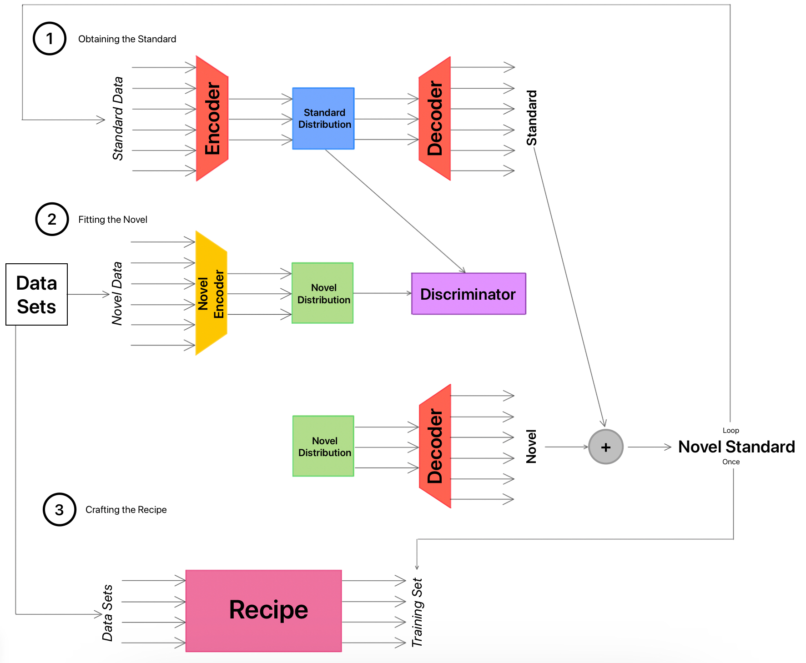

# Model Plan

1. [Training the Model](#part-1)
    - [Finding the Standard Distribution](#part-1a)
    - [Adding a novel data set](#part-1b)
    - [Ensuring Biological Signal](#part-1c)
    - [Iteration](#part-1d)
    - [Creating the "recipe"](#part-1e)
    - [Further Testing](#part-1f)
    - [The Data sets](#part-1g)
2. [Model Architecture](#part-2)
    - [Standard Auto-Encoder](#part-2a)
    - [Novel Adversarial Network](#part-2b)
    - [Recipe Network](#part-2c)
3. [Model Diagram](#part-3)

## Training the Model {#part-1}
<!--{-->

### Finding the Standard Distribution {#part-1a}
<!--{-->

- I am going to use the *METABRIC* data set as the standard for one reason: it has the largest number of data points
    - I want a well defined standard distribution to start with so that the other data sets can be forced to fit it well.
    - If it is not well defined, I fear that I won't be able to train a discriminator very well in the latter step
    - This data set does not have a good positive/negative class ratio (1498/439), but since I don't plan to take the class into account as I work, I don't foresee that being an issue
        - That being said, I can foresee a problem in that there will not be as much distribution in the positive area of the latent space...
- The way I am going to get my standard distribution is the following:
    - Set up an Auto-Encoder network with the data set as both the input and target
    - Set up various layers to reduce the dimensionality of the initial data set
        - The number of layers will depend on the number of features
        - I am thinking that I should make the final number of dimensions in the latent space 10 or so.
        - The number 10 feels pretty low, so I will have to see what number allows me to get good reconstruction without being too high
        - I am going to mess around and do it with 2 at first, just to see what the data looks like at that low a dimensionality
    - Once I have good reconstruction of the data, I will take just the **Encoder** and transform the *METABRIC* data to a new data set with its own distribution
- I will separate the **Decoder** and use it for the sole purpose of reinflating data from the latent space later on
- To make sure that we have not lost anything in this process, I will train a Random Forest ML on the Standard before transformation and test it on the data after the transformation
    - If the accuracy is the same for both sets (it will likely be 100%, since random forests have overfit in my previous work), then I can be sure I have lost nothing of import
    - I will keep this trained model for future use

<!--}-->

### Adding a novel data set {#part-1b}
<!--{-->

- Once I have the **Standard**, I will alter a novel data set to fit it
- I will use a **Novel Encoder** to get a latent space representation of the new data set
- I will use a **Discriminator** to learn to differentiate between batches of points that come from the **Standard** and those that come from the novel data
    - I will be trying to classify a set of points as being either *Standard* or *Novel*
    - I will show the **Discriminator** one *Novel* set for every *Standard* set
    - I will have to freeze the **Discriminator** when training the **Novel Encoder**
    - There will be four training instances:
        - Data from the *Standard*, to train the **Discriminator**
        - Data from the *Novel*, to train the **Novel Encoder** [**Discriminator** frozen]
        - Data from the *Novel*, to train the **Discriminator**
        - Data from the *Novel*, to train the **Novel Encoder** [**Discriminator** frozen]
- Once I have used the adversarial network to create a **Novel Encoder** that can cause the **Discriminator** to achieve only 50% accuracy, I will use the **Novel Encoder** to transform the novel data into latent space
- I will use that latent space representation in the standard's **Decoder** to reinflate it and add it to the **Standard**

<!--}-->

### Ensuring Biological Signal {#part-1c} 
<!--{-->

- To ensure that the transformed data has not lost its biological signal, I will train a Random Forest to predict the class of interest (ER status in this case) on the **Novel Set**
    - For more rigorous testing, I would redo the whole process with a different feature as the Class, in order to make sure I am keeping all of the biological signal
        - Otherwise, I could do the process once and at the end test if the biological signal has been kept for all things through the whole process
            - This is the better option I feel
    - If the random forest can achieve a good accuracy, I can be confident that the transformation has not significantly altered the biological signal of the **Novel Set**
- To ensure that the transformation has accomplished something real, I will do the following:
    - Use the Random Forest ML trained earlier to predict on the novel data set before transformation
    - Train a new Random Forest ML on the transformed **Standard**
    - Predict on the transformed **Novel Set** with this latter model
    - Compare the accuracies of prediction from before the novel set's transformation to after
        - If the prediction accuracy is increased, I can be confident that the transformation was successful in transforming the data while keeping biological signal present

<!--}-->

### Iteration {#part-1d}
<!--{-->

- Once I have done the above steps, I will follow an iterative process to combine all the data sets
- I will combine the **Standard** and reinflated **Novel Set** to create a new standard data set
- I will use that **Novel Standard** to create a new Auto-Encoder
- I will use a new novel data set in the adversarial network to transform it to fit to the **Novel Standard**
- For each step, I will ensure that the novel data set does not lose its biological signal, and that it becomes indistinguishable from the **Novel Standard**

- In order to create a deliverable as mentioned below, I need to track the network parameters that allow conformation to happen smoothly
    - I need to find an automated way to determine these hyperparameters
    - I need to find some stopping criterion to let me know that the novel data sets are conformed

<!--}-->

### Creating the "recipe" {#part-1e}
<!--{-->

- Once I have all of the transformed data sets, I will have to create a "recipe" for novel data that is not going to become part of the "training set"
- I will create a final Neural Network:
    - The input will be the original data sets, concatenated together
    - The output will be the combined transformed data from the iterations above, the **Training Data**
    - The network will be one large skip connection, to allow it to only have to learn what to add/subtract from the original data, not having to recreate the data as a whole with the transformation
- This **Recipe** will allow me to take even one data point and transform it in such a way that it could be predicted on with any sort of ML trained on the combined **Training Data**

<!--}-->

### Further Testing {#part-1f}
<!--{-->

- I have two sets of data sets: training and testing
- The training data set is to try out this technique and see how well it works.
- The testing data set is to use for the final technique that I come up with (which may not be this one, though I hope it is)
- In order to ensure the accuracy of my method, I have to reserve some of the training data sets as validation data sets (see the split below)
- Here is what I am going to do with the validation sets:
    - I will leave them out of the process of combination that has been detailed above
    - Once I have combined the other data sets, I will create the **Recipe**
    - I will also train a Random Forest model on that data set
    - I will run my validation set through the **Recipe** to prepare it
    - Then, I will see how the model trained on my Training Set performs
- With earlier testing, I just made sure that the biological signal was not lost while the differences between data sets was
- With this testing, I am making sure that the information has been retained in such a way that it can be useful for creating further ML models

<!--}-->

### The Data sets {#part-1g}
<!--{-->

- The following is a table explaining the abbreviations I use for the different platforms that data is collected on:

|             Collection Platform              | Abbreviation |
| :------------------------------------------- | :----------- |
| Illumina Human HT-12 v3 Expression Beadchips |    IHHTEB    |
| Custom Affymetrix Human Transcriptome Array  |    CAHTA     |
| Affymetrix Human Genome U133 Plus 2.0 Array  |   AHGUP2A    |
|     Affymetrix Human Genome U133A Array      |    AHGUA     |
|      Affymetrix Human Gene 1.0 ST Array      |    AHG1SA    |
|           Illumina Genome Analyzer           |     IGA      |
|             Illumina NextSeq 500             |     INS5     |
|             Illumina HiSeq 2000              |     IHS2     |

- Here are the Training Sets:

| Data set  | Platform | Class Counts (+/-) |
| :-------- | :------- | :----------------: |
| METABRIC  |  IHHTEB  |     1498 / 439     |
| GSE19615  | AHGUP2A  |       66 / 45      |
| GSE21653  | AHGUP2A  |      150 / 113     |
| GSE20194  |  AHGUA   |      155 / 96      |
| GSE25055  |  AHGUA   |      166 / 125     |
| GSE58644  |  AHG1SA  |      250 / 70      |
| GSE62944  |   IGA    |      785 / 230     |
| GSE81538  |   IHS2   |      315 / 82      |
| GSE96058N |   INS5   |      263 / 27      |

- Here are the Validation Sets:

| Data set  | Platform | Class Counts (+/-) |
| :-------- | :------- | :----------------: |
| GSE31448  | AHGUP2A  |      188 / 161     |
| GSE25065  |  AHGUA   |      117 / 66      |
| GSE123845 |   IHS2   |       58 / 78      |

- Here are the Test Sets:

| Data set  | Platform | Class Counts (+/-) |
| :-------- | :------- | :----------------: |
| GSE20271  | AHGUP2A  |       92 / 64      |
| GSE23720  | AHGUP2A  |      131 / 66      |
| GSE45255  |  AHGUA   |       86 / 47      |
| GSE76275  |  AHGUA   |       49 / 216     |
| GSE96058H |   IHS2   |    2,569 / 214     |
| GSE163882 |   INS5   |      104 / 117     |
| GSE115577 |  CAHTA   |      877 / 226     |

<!--}-->

### The Deliverable {#part-1h}
<!--{-->

- Once all is said and done, I want to have some tool that I can send out to people to use as they wish.
- A lot of the testing and ensuring I will be doing in my process is not something that will be part of the tool.
- Here is how I see the tool (I will come up with a creative name for it later) working:
    - It is given a bunch of data sets in the order that they should be joined to one another, the first data set being the standard
    - It creates the **Standard** Encoder/Decoder
    - It adds the novel data set, making sure to get as close to 50% with the **Discriminator** as possible
    - It creates the **Novel Standard** and iterates through the whole of the data sets
    - It returns a unified data set to the user, along with the **Recipe** for that training set
    - It does not ever need to know the class that the user is interested in, as it does not test the classification at any point
- My work with the breast cancer data is all about making sure the method works. All of the Random Forest and Classification that I will do will just be to ensure that the tool is doing what I want it to before I can let others use it
    - That is why I need to test that my combined data set, combined using the ER status to make sure that I retain biological signal, can also predict things other than ER status when everything is combined.
    - That is why I need to make sure that a model trained on a combined data set can actually predict on novel data and do a good job of it.

<!--}-->

<!--}-->

## Model Architecture {#part-2}
<!--{-->

### Standard Auto-Encoder {#part-2a}
<!--{-->

- I think, by arbitrary decision, that there should be four layers of compression in the **Encoder**
    - In this case that will look as follows:
        - 100 -> 75 -> 50 -> 25 -> 10
    - In other cases (when I generalize), I will compute the sizes of the layers based on the number of input features
    - To get a look at the data, I will then go 10 -> 2 so I can easily plot the data
- In order to decompress the data, the **Decoder** will have the same four layers in reverse
    - 10 -> 25 -> 50 -> 75 -> 100
- I will create each of these model separately, as I will need to use them separately, but then combine them into one for training
- Here is a list of parameters for the layers (found by optimization):
    - 

<!--}-->

### Novel Encoder and Discriminator {#part-2b}
<!--{-->

- The **Novel Encoder** will be the same set up as the **Encoder** above
- The **Discriminator** will take in the output of the Encoders, have some hidden layers, and then a single output (since this will be binary classification)
    - Here is my arbitrary choice of layer sizes:
        - 10 -> 32 -> 64 -> 32 -> 1
- Here is a list of parameters for the layers (found by optimization):
    - 

<!--}-->

### Recipe Network {#part-2c}
<!--{-->

- This network will aim to take the 100 features and transform them into another 100 features
- The input to this network will be a concatenation of all of the data sets before transformation
- The output will be the entire **Training Set**, all of the transformed data
- The layers will be as follows:
    - 100 -> 200 -> 200 -> 100
    - The input and output have to be the size of the features (which is 100 in this case)
    - The 200-size layers in the middle are an arbitrary choice
- The hyperparameters for the layers are as follows (obtained through optimization)

<!--}-->

<!--}-->

## Model Diagram {#part-3}
<!--{-->

<!--}-->

