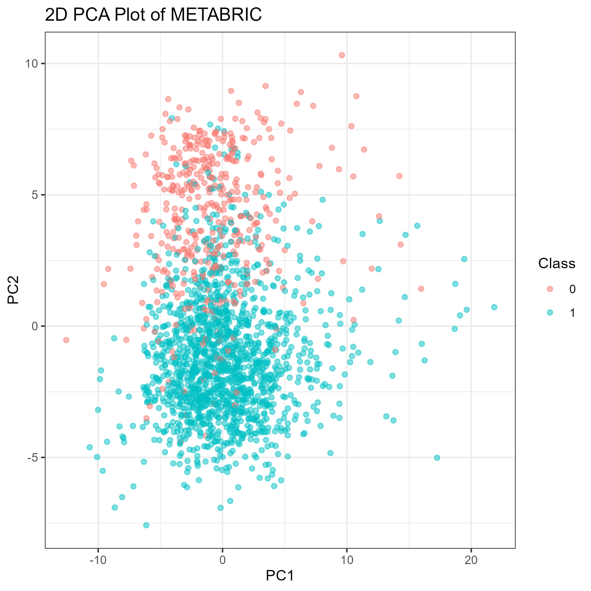
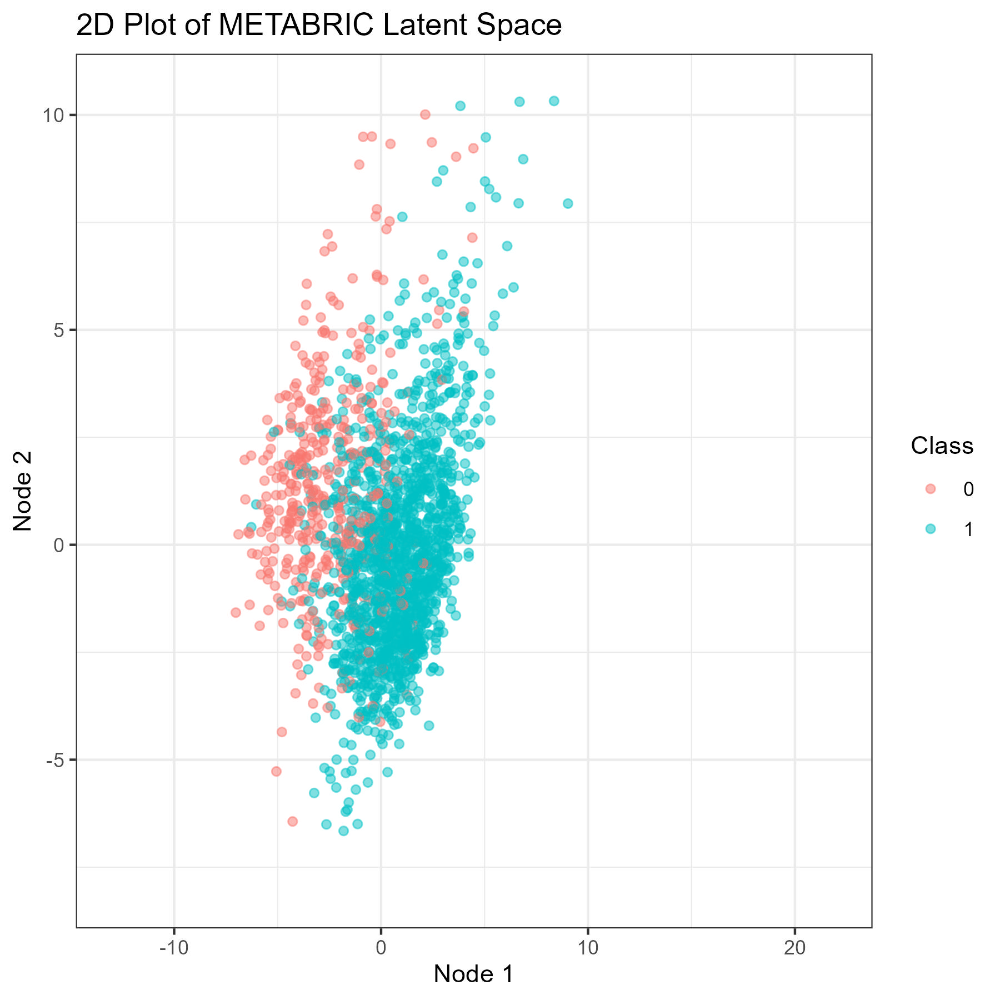

# Standard Auto-Encoder

-   These notes explain what is happening in [Script 10](../scripts/10_Standard_Auto_Encoder.R)

1.  [Loading Functions and Libraries](#part-1)
2.  [Preparing the data](#part-2)
3.  [Creating the network](#part-3)
4.  [Training the network](#part-4)
5.  [Testing the network](#part-5)
6.  [Creating the 2D network](#part-6)
7.  [Visualizing the data](#part-7)
8.  [Saving the data](#part-8)
9.  [Clean up](#part-9)
10. [Results](#part-10)

## Loading Functions and Libraries {#part-1}

<!--{-->

-   Here I load the following libraries:
    -   `tidyverse` (to work with tibbles)
    -   `keras3` (the ML driver)
    -   `rsample` (to split the data)
-   In addition, I load the following functions
    -   `readFiles.R` (to read in files)
    -   `plotPCA.R` (to automate PCA visualization)

```{r}
library(tidyverse)
library(keras3)
library(rsample)
source("functions/readFiles.R")
source("functions/plotPCA.R")
```

<!--}-->

## Preparing the data {#part-2}

<!--{-->

-   Here I read in the standard data (the <i>METABRIC</i> data set)
    -   I pull out only the first 100 of the reduced subset of genes for the purposes of this trial
-   I pull out the classes for plotting purposes later
-   I remove the classes from my data that is to be trained, as I don't want class to influence anything in how the Auto-Encoder works
-   I split the data in to a train, validation, and test set to evaluate the model

```{r}
# get the common genes (the reduced subset)
genes = readLines("variables/lessGenes.txt")[1:100]

# read in the Standard data (don't include the class)
readFiles("METABRIC", columns = c("Class", genes))
data = METABRIC

# separate out the Class
classes = data |> select(Class) |> mutate(Class = as.factor(Class))
data = data |> select(-Class)

# set the seed
set.seed(0)

# split into test and train data (not in the final Deliverable)
dataSplit = data |>
    initial_split(prop = 0.7)
train = training(dataSplit)
test = testing(dataSplit)

# split train into train and val
trainSplit = train |>
    initial_split(prop = 0.7)
train = training(trainSplit)
val = testing(trainSplit)
```

<!--}-->

## Creating the Network {#part-3}

<!--{-->

-   I create a network with the following structure:
    -   The Encoder (determined via optimization):
        -   An input of 100 features
        -   A deflating layer of 55 nodes
        -   An embedding layer of 10 nodes
    -   The Decoder (determined via optimization):
        -   An input of 10 features (the latent space)
        -   An inflating layer of 55 nodes
        -   An output layer of 100 nodes
    -   An AutoEncoder that concatenates the Encoder and Decoder
    -   I considered using dropout layers, but found that they did not help
-   I compile with the following hyperparameters:
    -   Optimizer: `adam` (determined by optimization)
    -   Loss: Mean Squared Error
    -   Metric: Mean Absolute Error

```{r}
# set the seed
tensorflow::set_random_seed(0)

# initialize some variables
inputSize = length(genes)
embeddingSize = 10
layers = 2
dropout = FALSE
layerDrop = ceiling((inputSize - embeddingSize) / layers)
actFun = "elu"
optimizer = "adam"
loss = "mse"
metric = "mae"

# define the Encoder
Encoder = keras_model_sequential(input_shape = c(inputSize),
                                 name = paste0("Encoder_",
                                               embeddingSize,
                                               "D"))
for(layer in 1:(layers - 1)) {
    Encoder |> 
        layer_dense(units = inputSize - layerDrop * layer,
                           activation = actFun,
                           name = paste0("Deflate_", layer))
    if(dropout) {
        Encoder|>
            layer_dropout(rate = 0.4,
                          name = paste0("Dropout_", layer))
    }
}
Encoder |>
    layer_dense(units = embeddingSize,
                name = "Embedding")

# define the Decoder
Decoder = keras_model_sequential(input_shape = c(embeddingSize),
                                 name = paste0("Decoder_",
                                               embeddingSize,
                                               "D"))
for(layer in 1:(layers - 1)) {
    Decoder |> 
        layer_dense(units = embeddingSize + layerDrop * layer,
                    activation = actFun,
                    name = paste0("Inflate_", layer))
    if(dropout) {
        Decoder |>
            layer_dropout(rate = 0.4,
                          name = paste0("Dropout_", layer))
    }
}
Decoder |>
    layer_dense(units = inputSize,
                name = "Output")

# build the AutoEncoder
input = layer_input(shape = c(inputSize),
                    name = "Input")
encodedLayer = Encoder(input)
decodedLayer = Decoder(encodedLayer)
AutoEncoder = keras_model(inputs = input,
                          outputs = decodedLayer,
                          name = paste0("AutoEncoder_",
                                        embeddingSize,
                                        "D"))

# compile the AutoEncoder
AutoEncoder |> compile(
    optimizer = optimizer,
    loss = loss,
    metrics = metric
)
```

<!--}-->

## Training the Network {#part-4}

<!--{-->

-   I trained the network for 75 epochs (my optimization showed that the network typically converged before this point)
-   I trained with a batch size of 6 (determined by optimization)
-   I used early stopping based on the validation set loss

```{r}
# declare some variables
epochs = 75
batchSize = 6

# make a callback function
stopEarly = callback_early_stopping(
    monitor = "val_loss",
    patience = 10,
    restore_best_weights = TRUE,
    mode = "min"
)

cat("\n  Training ", embeddingSize, "D network:", sep = "")
start = Sys.time()

# train the AutoEncoder
history = AutoEncoder |> fit(
    x = as.matrix(train),
    y = as.matrix(train),
    batch_size = batchSize,
    epochs = epochs,
    validation_data = list(as.matrix(val),
                           as.matrix(val)),
    callbacks = stopEarly,
    verbose = 0
)

end = Sys.time()
cat(" Done in", substring(seconds(end - start), 1, 6), "\n")
```

<!--}-->

## Testing the network {#part-5}

<!--{-->

-   I measured some values regarding the data before any transformation to better evaluate my metrics and understand the transformation on my data
-   I tested the network on the validation set during optimization in order to minimize the MAE (see the table of optimization parameters below)
-   Following optimization, I evaluated the test set to make sure the network was still generalizable

```{r}
# get some info about the data
mat = as.matrix(data)
cat("\n  Data Metrics:")
cat("\n    The max is:\t\t", max(mat))
cat("\n    The min is:\t\t", min(mat))
cat("\n    The mean is:\t", mean(mat))
cat("\n    The median is:\t", median(mat))
cat("\n")

# evaluate the test set
cat("\n  Evaluating Validation set:")
valEval = AutoEncoder |> evaluate(as.matrix(val),
                                     as.matrix(val),
                                  verbose = 0)

# # print out the metrics
cat("\n    Validation Set MSE:", valEval[[1]])
cat("\n    Validation set MAE:", valEval[[2]])
cat("\n")

# Print out the optimization info
# cat("\n|",
#     layers, "|",
#     actFun, "|",
#     optimizer, "|",
#     embeddingSize, "|",
#     dropout, "|",
#     batchSize, "|",
#     which.min(history$metrics$val_loss), "|",
#     round(valEval[[2]], 3), "|")

# evaluate the test set
cat("\n  Evaluating Test set:")
testEval = AutoEncoder |> evaluate(as.matrix(test),
                                     as.matrix(test),
                                   verbose = 0)

# # print out the metrics
cat("\n    Test Set MSE:", testEval[[1]])
cat("\n    Test set MAE:", testEval[[2]])
cat("\n")
```

-   I altered the following hyperparameters as I optimized:
    -   The number of layers
    -   The activation function used
        -   Here I could have altered more things about the learning rate or parameters like epsilon, alpha, etc., but I chose not to
    -   The number of dimensions in the latent space
        -   Though I could get great MAE values with more dimensions, I want to keep the number of dimensions low for the next part of the model
        -   I feel the data would be too sparse to be efficient if there are too many dimensions
    -   Whether or not to use dropout layers
        -   I had a fixed size dropout rate any time I used it
    -   The batch size used to train
-   I kept track of the MAE for each optimization test, as well as the number of epochs needed to converge
    -   The bold line shows the final parameters I chose to use:
        -   Optimizer: `adam`
        -   Layers: `2`
        -   Function: `elu`
        -   Latent Size: `10`
        -   Dropout: `FALSE`
        -   Batch Size: `6`

| Layers |  Function  | Optimizer | Latent Size |  Dropout  | Batch Size | Epochs |    MAE    |
|:-------:|:-------:|:-------:|:-------:|:-------:|:-------:|:-------:|:-------:|
|   4    |    elu     |   ftrl    |     10      |   FALSE   |     32     |   1    |   0.777   |
|   2    |    elu     |   adam    |      2      |   FALSE   |     32     |   46   |   0.637   |
|   6    |    elu     |   adam    |     10      |   TRUE    |     32     |  137   |   0.637   |
|   4    |    elu     | adadelta  |     10      |   FALSE   |     32     |  1000  |   0.634   |
|   4    |    elu     |   adam    |      2      |   FALSE   |     32     |   25   |   0.628   |
|   4    |  sigmoid   |   adam    |     10      |   FALSE   |     32     |   99   |   0.599   |
|   4    |    elu     |    sgd    |     10      |   FALSE   |     32     |  100   |   0.582   |
|   2    |    elu     |   adam    |      5      |   FALSE   |     32     |   73   |   0.544   |
|   4    |    elu     |   adam    |      5      |   FALSE   |     32     |   25   |   0.544   |
|   4    |    elu     |  adagrad  |     10      |   FALSE   |     32     |  1000  |   0.534   |
|   10   |    elu     |   adam    |     10      |   FALSE   |     32     |   39   |   0.516   |
|   4    |    relu    |   adam    |     10      |   FALSE   |     32     |   51   |   0.512   |
|   4    |    gelu    |   adam    |     10      |   FALSE   |     32     |   42   |   0.506   |
|   8    |    elu     |   adam    |     10      |   FALSE   |     32     |   34   |   0.506   |
|   2    |    elu     |   adam    |     10      |   TRUE    |     32     |  107   |   0.499   |
|   4    | leaky_relu |   adam    |     10      |   FALSE   |     32     |   43   |   0.499   |
|   4    |    elu     |  rmsprop  |     10      |   FALSE   |     32     |   46   |   0.489   |
|   4    |    elu     |   adam    |     10      |   FALSE   |     32     |   29   |   0.488   |
|   5    |    elu     |   adam    |     10      |   FALSE   |     32     |   34   |   0.488   |
|   4    |    relu    |   adam    |     20      |   FALSE   |     32     |   34   |   0.487   |
|   4    |   swish    |   adam    |     20      |   FALSE   |     32     |   48   |   0.487   |
|   1    |    elu     |   adam    |     10      |   FALSE   |     32     |  171   |   0.485   |
|   0    |    elu     |   adam    |     10      |   FALSE   |     32     |  134   |   0.484   |
|   3    |    elu     |   adam    |     10      |   FALSE   |     32     |   46   |   0.484   |
|   4    |    relu    |   adam    |     30      |   FALSE   |     32     |   38   |   0.483   |
|   2    |    elu     |   adam    |     10      |   FALSE   |     64     |  109   |   0.48    |
|   2    |    elu     |   adam    |     10      |   FALSE   |     32     |   78   |   0.479   |
| **2**  |  **elu**   | **adam**  |   **10**    | **FALSE** |   **6**    | **38** | **0.478** |
|   2    |    elu     |   adam    |     10      |   FALSE   |     12     |   50   |   0.478   |
|   4    | leaky_relu |   adam    |     20      |   FALSE   |     32     |   47   |   0.467   |
|   4    |    relu    |   adam    |     50      |   FALSE   |     32     |   74   |   0.459   |
|   4    |    elu     |   adam    |     20      |   FALSE   |     32     |   42   |   0.425   |
|   4    |    elu     |   adam    |     90      |   FALSE   |     32     |   55   |   0.275   |
|   4    |    elu     |   adam    |     100     |   FALSE   |     32     |  148   |   0.216   |

<!--}-->

## Creating the 2D network {#part-6}

<!--{-->

-   I want to see how a 2D network compares to the PCA visualization of the data, so I built a network that reduced my 100 genes down to 2 dimensions rather than 10
-   Everything is the same between this network and the one above, save that the Embedding Size is 2 instead of 10.

```{r}
# define variables
embeddingSize = 2

# define the Encoder
Encoder_2D = keras_model_sequential(input_shape = c(inputSize),
                                 name = paste0("Encoder_",
                                               embeddingSize,
                                               "D"))
for(layer in 1:(layers - 1)) {
    Encoder_2D |> 
        layer_dense(units = inputSize - layerDrop * layer,
                    activation = actFun,
                    name = paste0("Deflate_", layer))
    if(dropout) {
        Encoder_2D|>
            layer_dropout(rate = 0.4,
                          name = paste0("Dropout_", layer))
    }
}
Encoder_2D |>
    layer_dense(units = embeddingSize,
                name = "Embedding")

# define the Decoder
Decoder_2D = keras_model_sequential(input_shape = c(embeddingSize),
                                 name = paste0("Decoder_",
                                               embeddingSize,
                                               "D"))
for(layer in 1:(layers - 1)) {
    Decoder_2D |> 
        layer_dense(units = embeddingSize + layerDrop * layer,
                    activation = actFun,
                    name = paste0("Inflate_", layer))
    if(dropout) {
        Decoder_2D |>
            layer_dropout(rate = 0.4,
                          name = paste0("Dropout_", layer))
    }
}
Decoder_2D |>
    layer_dense(units = inputSize,
                name = "Output")

# build the AutoEncoder
input = layer_input(shape = c(inputSize),
                    name = "Input")
encodedLayer = Encoder_2D(input)
decodedLayer = Decoder_2D(encodedLayer)
AutoEncoder_2D = keras_model(inputs = input,
                          outputs = decodedLayer,
                          name = paste0("AutoEncoder_",
                                        embeddingSize,
                                        "D"))

# compile the AutoEncoder
AutoEncoder_2D |> compile(
    optimizer = optimizer,
    loss = loss,
    metrics = metric
)

cat("\n  Training ", embeddingSize, "D network:", sep = "")
start = Sys.time()

# train the network
history_2D = AutoEncoder_2D |> fit(
    x = as.matrix(train),
    y = as.matrix(train),
    batch_size = batchSize,
    epochs = epochs,
    validation_data = list(as.matrix(val),
                           as.matrix(val)),
    callbacks = stopEarly,
    verbose = 0
)

end = Sys.time()
cat(" Done in", substring(seconds(end - start), 1, 6), "s\n")
```

<!--}-->

## Visualizing the Data {#part-7}

<!--{-->

-   I first perform a PCA on the <i>METABRIC</i> data and plot the points using the top two principal components
-   Then I reduce the data to 2 dimensions using the Encoder and plot the points in those two dimensions
-   The plots are located below

```{r}
# define the folder to use for plots
subFolder = "10_Standard_Auto_Encoder/"
plots = paste0("plots/", subFolder)
if(!dir.exists(plots)) dir.create(plots)

# do the PCA
plotPCA("METABRIC",
        title = "2D PCA Plot of METABRIC",
        folder = plots,
        filename = "pcaStandardPlot")

cat("  Plotting 2D Data:\n")
# get the 2D version of the data
data2D = Encoder_2D |>
            predict(as.matrix(data),
                    verbose = 0)

# prepare it for plotting
suppressMessages({data2D = as_tibble(data2D, .name_repair = "unique")})
names(data2D) = c("x", "y")
data2D = bind_cols(data2D, classes)

# plot the data
plot2D = data2D |>
    ggplot(aes(x = x, y = y, color = Class)) +
    geom_point(alpha = 0.5) +
    labs(x = "Node 1", 
         y = "Node 2",
         title = "2D Plot of METABRIC Latent Space",
         color = "Class") +
    theme_bw() +
    xlim(-13, 22) +
    ylim(-8, 10.5)

# save the file
suppressWarnings({ggsave(paste0(plots, "latentSpaceStandard.jpg"), plot2D,
       width = 6, height = 6, unit = "in")})
cat("    ,
    "){width=100%}\n", sep = "")
cat("\n")
```

<!--}-->

## Saving the data {#part-8}

<!--{-->

-   I saved the models for later use
-   I also ran the <i>METABRIC</i> data through the Encoder in order to get its distribution for later use and saved that

```{r}
cat("  Saving the Data:\n")
# define the folder to use for the models
models = paste0("models/", subFolder)
if(!dir.exists(models)) dir.create(models)

# save the models
save_model(Encoder, paste0(models, "encoder.keras"), overwrite = TRUE)
save_model(Decoder, paste0(models, "decoder.keras"), overwrite = TRUE)
save_model(AutoEncoder, paste0(models, "autoEncoder.keras"), overwrite = TRUE)
save_model(Encoder_2D, paste0(models, "encoder2D.keras"), overwrite = TRUE)
save_model(Decoder_2D, paste0(models, "decoder2D.keras"), overwrite = TRUE)
save_model(AutoEncoder_2D, paste0(models, "autoEncoder2D.keras"), overwrite = TRUE)

# define the folder to use for the model data
dist = paste0("variables/Model_Data/")
if(!dir.exists(dist)) dir.create(dist)

# get the standard distribution and save it
distribution = Encoder |> predict(as.matrix(data),
                                  verbose = 0)
suppressMessages({distribution = as_tibble(distribution, .name_repair = "unique")})
names(distribution) = c(paste0("d", 1:10))
distribution = bind_cols(distribution, classes)

write_tsv(distribution, paste0(dist, "Standard_Distribution.tsv"))

cat("\b Done\n")
```

<!--}-->

## Clean up {#part-9}

<!--{-->

```{r}
# remove everything
suppressWarnings({
rm(start,
   genes,
   METABRIC,
   readFiles,
   plotPCA,
   inputSize,
   embeddingSize,
   actFun,
   layerDrop,
   dataSplit,
   trainSplit,
   train,
   val,
   test,
   data,
   epochs,
   batchSize,
   loss,
   metric,
   optimizer,
   input,
   encodedLayer,
   decodedLayer,
   stopEarly,
   mat,
   layer,
   layers,
   dropout,
   testEval,
   valEval,
   plots,
   subFolder,
   classes,
   history,
   history_2D,
   data2D,
   AutoEncoder,
   AutoEncoder_2D,
   Encoder,
   Encoder_2D,
   Decoder,
   Decoder_2D,
   models,
   plot2D,
   distribution,
   dist,
   end)
})

# Free up space
invisible({gc()})
```

<!--}-->

## Results {#part-10}

<!--{-->

-   Here are the results of the network
    -   Validation Set MSE: 0.3989224
    -   Validation set MAE: 0.4779026
    -   Test Set MSE: 0.4232225
    -   Test set MAE: 0.4928536
-   The network performed slightly worse on the test set, but not by much
    -   It seems the network generalized well enough
-   Here are the plots created by PCA and the 2D Encoder
    -   The Encoder mainly seems to have compressed the points to a smaller range and rotated them slightly

{width="100%"} {width="100%"}

<!--}-->
