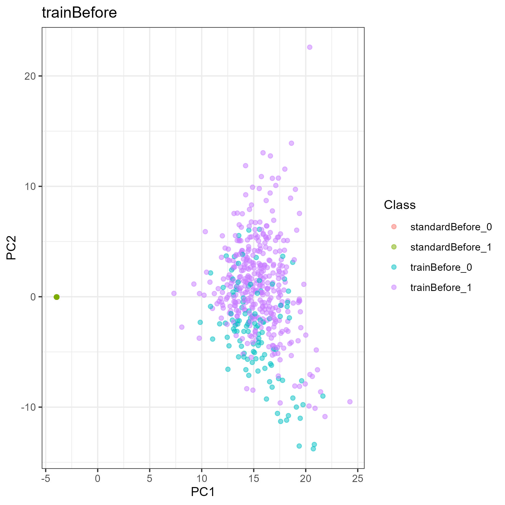
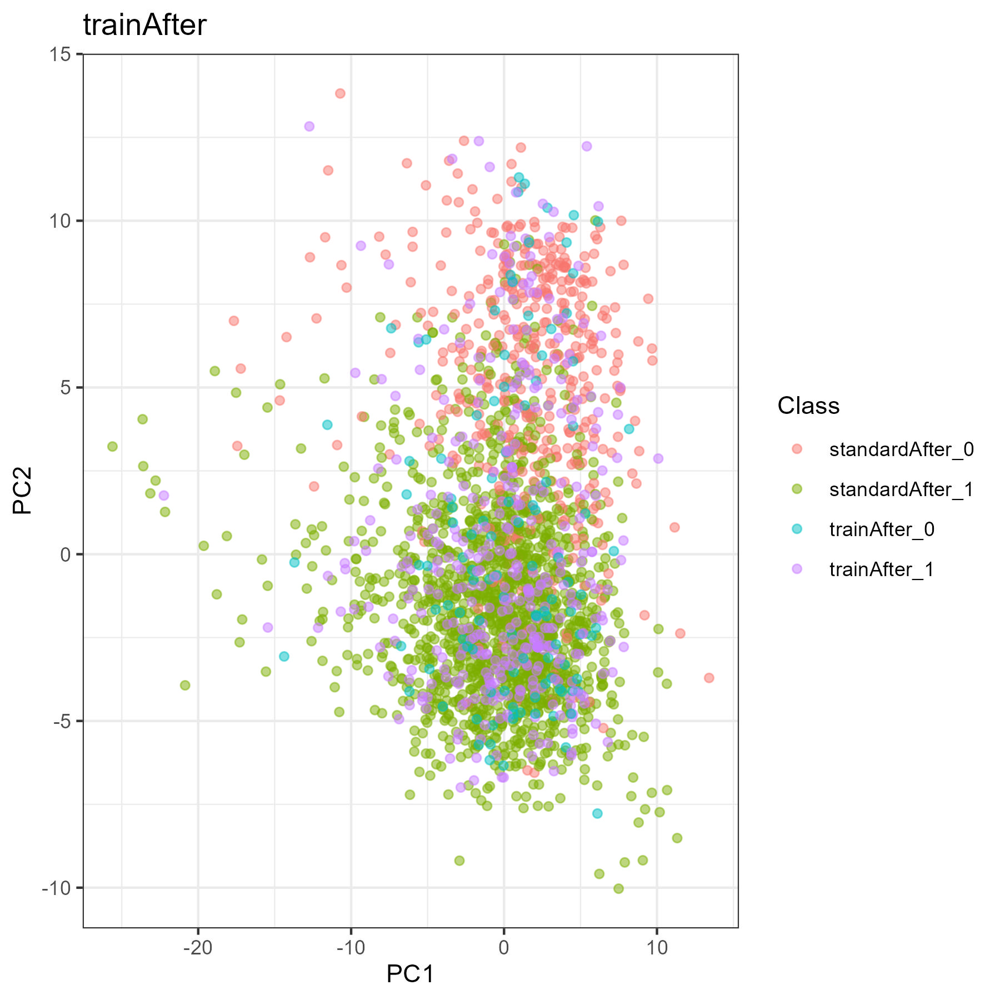
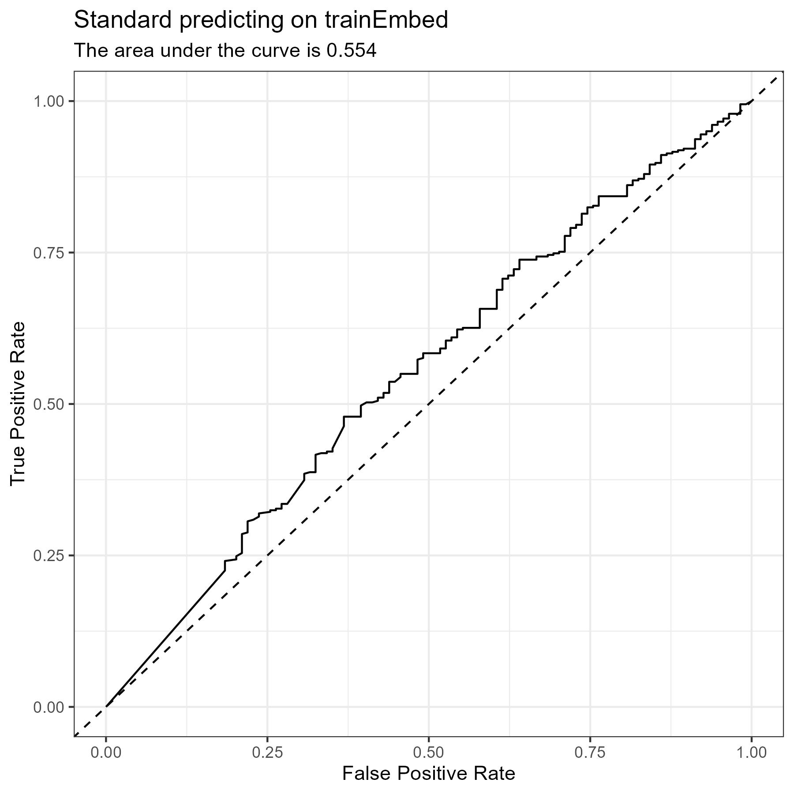
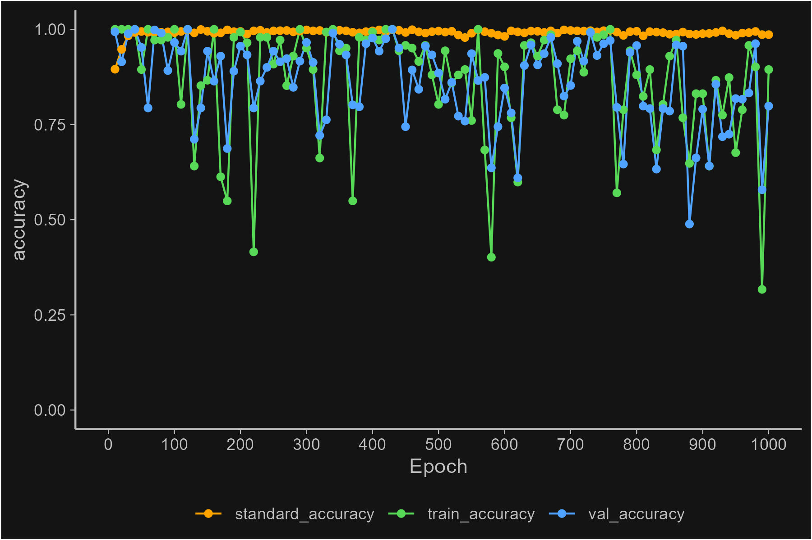
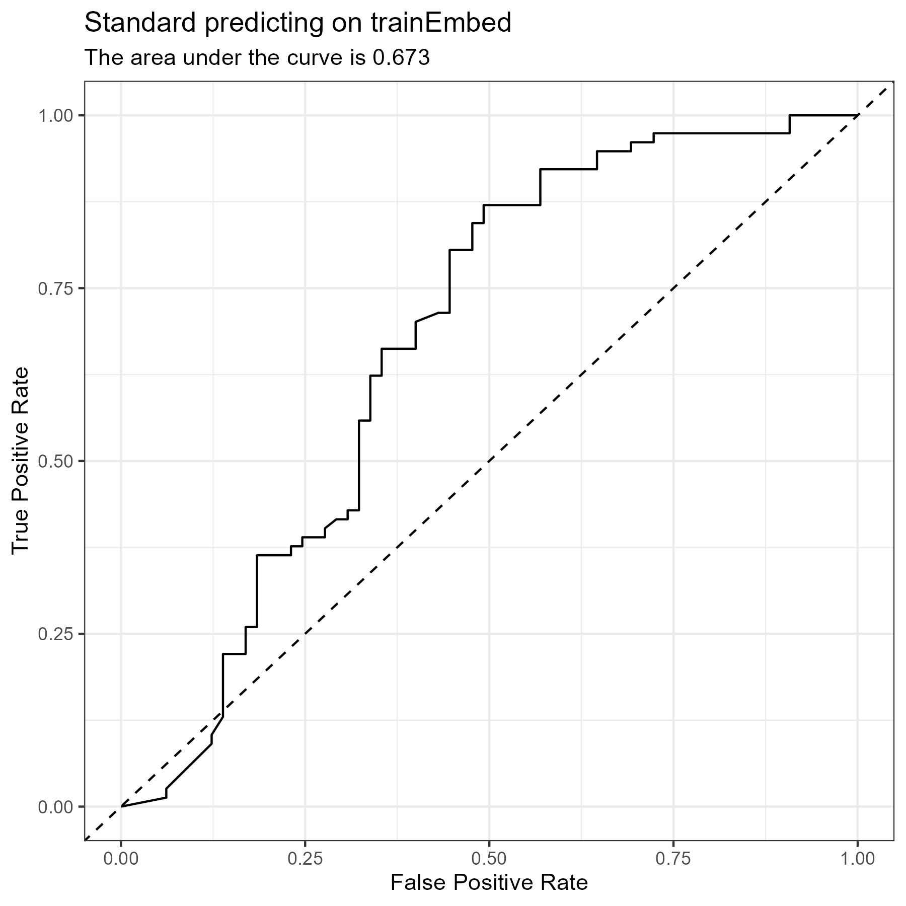
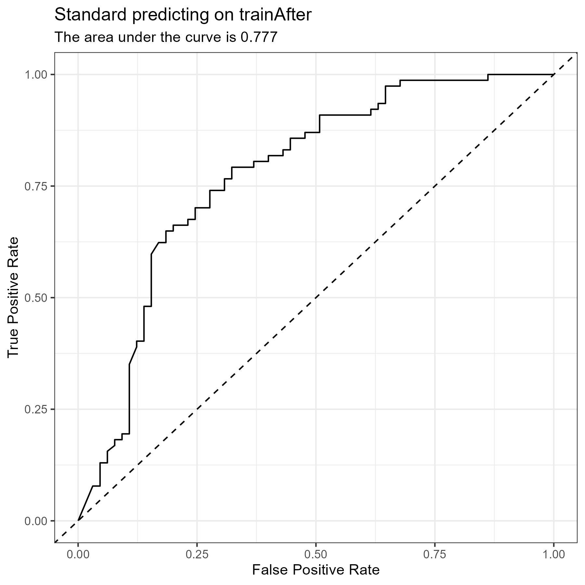

# Adversarial Network

- This contains the contents obtained form the [Adversarial Network Script](../scripts/17_Adversarial_Network)

# Optimization Data
<!--{-->

| Encoder Layers | Discriminator Layers | Discriminator Units | Function | Discriminator Function | Optimizer | Dropout | Batch Size | Epochs | Rel SD Val | Val Max | Val Accuracy |
|:----:|:----:|:----:|:----:|:----:|:----:|:----:|:----:|:----:|:----:|:----:|:----:|
| 2 | 4 | 32 | elu | elu | adam | FALSE | 16 | 100 | 0.049 | 13044.8 | 100 |
| 2 | 4 | 32 | elu | elu | adam | FALSE | 32 | 100 | 0.030 | 23838.76 | 100 |
| 2 | 4 | 32 | elu | elu | adam | FALSE | 48 | 100 | 0.036 | 24941.88 | 99.5 |
| 2 | 4 | 32 | elu | elu | adam | FALSE | 64 | 100 | 0.048 | 10426.83 | 99.1 |
| 2 | 4 | 32 | elu | elu | adam | FALSE | 128 | 100 | 0.04 | 26039.08 | 99.5 |
| 2 | 3 | 32 | elu | elu | adam | FALSE | 64 | 100 | 0.05 | 13425.99 | 100 |
| 2 | 3 | 64 | elu | elu | adam | FALSE | 64 | 100 | 0.038 | 20622.38 | 100 |
| 2 | 4 | 64 | elu | elu | adam | FALSE | 64 | 100 | 0.043 | 13677.62 | 100 |
| 3 | 3 | 32 | elu | elu | adam | FALSE | 64 | 96 | 0.051 | 7886.641 | 46.7 |
| 3 | 3 | 32 | elu | elu | adam | FALSE | 64 | 200 | 0.053 | 4244.374 | 95.8 |
| 4 | 3 | 32 | elu | elu | adam | FALSE | 64 | 200 | 0.062 | 458.098 | 78.5 |
| 4 | 4 | 32 | elu | elu | adam | FALSE | 64 | 100 | 0.122 | 495.909 | 96.7 |
| 5 | 4 | 32 | elu | elu | adam | FALSE | 64 | 100 | 0.088 | 112.122 | 87.4 |
| 5 | 5 | 32 | elu | elu | adam | FALSE | 64 | 200 | 0.138 | 17.097 | 98.1 |
| 6 | 5 | 32 | elu | elu | adam | FALSE | 64 | 200 | 0.049 | 268.46 | 99.1 |
| 5 | 3 | 32 | elu | elu | adam | FALSE | 64 | 200 | 0.051 | 439.732 | 55.1 |
| 6 | 4 | 32 | elu | elu | adam | FALSE | 64 | 200 | 0.056 | 80.943 | 88.3 |
| 3 | 2 | 32 | elu | elu | adam | FALSE | 64 | 200 | 0.045 | 6614.648 | 5.6 |
| 5 | 4 | 48 | elu | elu | adam | FALSE | 64 | 200 | 0.044 | 94.202 | 99.5 |
| 5 | 3 | 64 | elu | elu | adam | FALSE | 64 | 200 | 0.076 | 38.41 | 98.6 |
| 5 | 4 | 64 | elu | relu | adam | FALSE | 64 | 300 | 0.573 | 3.63 | 100 |
| 5 | 4 | 32 | elu | relu | adam | FALSE | 64 | 200 | 0.092 | 32.612 | 97.7 |
| 5 | 4 | 48 | elu | elu | adam | FALSE | 64 | 200 | 0.088 | 50.68 | 95.8 |
| 5 | 4 | 32 | elu | elu | adam | FALSE | 64 | 200 | 0.143 | 17.353 | 79.4 |
| 7 | 5 | 48 | elu | elu | adam | FALSE | 64 | 250 | 0.204 | 7.021 | 31.3 |

<!-- Now add Batch Normalization to the Decoder -->

| Encoder Layers | Discriminator Layers | Discriminator Units | Function | Discriminator Function | Optimizer | Dropout | Batch Size | Epochs | Rel SD Val | Val Max | Val Accuracy |
|:----:|:----:|:----:|:----:|:----:|:----:|:----:|:----:|:----:|:----:|:----:|:----:|
| 5 | 4 | 32 | elu | elu | adam | FALSE | 64 | 30 | 0.11 | 295670.8 | 0 |
| 5 | 3 | 32 | elu | elu | adam | FALSE | 64 | 30 | 0.166 | 12291966 | 0.5 |
| 3 | 3 | 32 | elu | elu | adam | FALSE | 64 | 30 | 0.14 | 334173.9 | 0 |
| 6 | 3 | 32 | elu | elu | adam | FALSE | 64 | 100 | 0.037 | 920406.8 | 0 |

<!-- With the updated algorithm to use fit() -->

| Encoder Layers | Discriminator Layers | Discriminator Units | Function | Discriminator Function | Optimizer | Dropout | Batch Size | Epochs | Rel SD Val | Val Max | Val Accuracy |
|:----:|:----:|:----:|:----:|:----:|:----:|:----:|:----:|:----:|:----:|:----:|:----:|
| 5 | 4 | 32 | elu | elu | adam | FALSE | 64 | 300 | 0.106 | 17.269 | 99.1 |

<!-- norm -->

| Encoder Layers | Discriminator Layers | Discriminator Units | Function | Discriminator Function | Optimizer | Dropout | Batch Size | Epochs | Rel SD Val | Val Max | Val Accuracy |
|:----:|:----:|:----:|:----:|:----:|:----:|:----:|:----:|:----:|:----:|:----:|:----:|
| 5 | 4 | 32 | elu | elu | adam | FALSE | 64 | 300 | 0.506 | 4.568 | 100 |

<!-- stopped shuffling myself -->

| Encoder Layers | Discriminator Layers | Discriminator Units | Function | Discriminator Function | Optimizer | Dropout | Batch Size | Epochs | Rel SD Val | Val Max | Val Accuracy |
|:----:|:----:|:----:|:----:|:----:|:----:|:----:|:----:|:----:|:----:|:----:|:----:|
| 5 | 4 | 32 | elu | elu | adam | FALSE | 64 | 300 | 0.577 | 8.563 | 99.1 |

<!-- lr=0.0001 -->

| Encoder Layers | Discriminator Layers | Discriminator Units | Function | Discriminator Function | Optimizer | Dropout | Batch Size | Epochs | Rel SD Val | Val Max | Val Accuracy |
|:----:|:----:|:----:|:----:|:----:|:----:|:----:|:----:|:----:|:----:|:----:|:----:|
| 5 | 4 | 32 | elu | elu | adam | FALSE | 64 | 300 | 0.069 | 71.4 | 98.1 |
| 6 | 4 | 32 | elu | elu | adam | FALSE | 64 | 300 | 0.099 | 67.326 | 99.1 |
| 6 | 4 | 32 | elu | elu | adam | FALSE | 64 | 500 | 0.051 | 114.735 | 99.5 |
| 7 | 4 | 32 | elu | elu | adam | FALSE | 64 | 500 | 0.056 | 193.471 | 39.7 |
| 7 | 5 | 32 | elu | elu | adam | FALSE | 64 | 500 | 0.159 | 45.534 | 70.1 |

<!-- lr = 0.0002 -->

| Encoder Layers | Discriminator Layers | Discriminator Units | Function | Discriminator Function | Optimizer | Dropout | Batch Size | Epochs | Rel SD Val | Val Max | Val Accuracy |
|:----:|:----:|:----:|:----:|:----:|:----:|:----:|:----:|:----:|:----:|:----:|:----:|
| 7 | 5 | 32 | elu | elu | adam | FALSE | 64 | 500 | 0.153 | 25.306 | 39.3 |
| 7 | 5 | 64 | elu | elu | adam | FALSE | 64 | 500 | 0.109 | 84.613 | 64 |
| 6 | 3 | 64 | elu | elu | adam | FALSE | 64 | 500 | 0.097 | 20.518 | 97.2 |
| 7 | 5 | 32 | elu | elu | adam | FALSE | 64 | 312 | 0.073 | 115.092 | 50 |
| 7 | 5 | 32 | elu | elu | adam | FALSE | 64 | 1000 | 0.135 | 27.735 | 22.9 |

<!--}-->

# GSE62944 Data
<!--{-->

- This is from conforming the GSE62944 data set to the METABRIC data set

- Model Details:
    - 7 in Encoder
    - 5 in Discriminator
    - 32 units
    - 64 Batch Size
    - 0.0002 Learning Rate
    - Stop Wait: 20

## Initial Classification (for comparison)
<!--{-->

  Stats:
    - Accuracy:     0.227
    - ROC AUC:     0.497

  Stats Each Recipe:
    - Accuracy:     0.864
    - ROC AUC:     0.932

| Recipe Set | ROC | PCA |
|:---:|:---:|:---:|
| GSE25055 |  |  |
| GSE62944 |  |  |

<!--}-->

## Training Plot

## Data Metrics
<!--{-->

| Data Set | Max | Min | Mean | Median | SD |
|:---:|:---:|:---:|:---:|:---:|:---:|
| standard [before] | 5.833 | -7.737 | 0 | 0.037 | 1 |
| train [before] | 175503.8 | 0 | 1889.474 | 1182.106 | 3273.683 |
| val [before] | 301461.9 | 0 | 1863.059 | 1191.859 | 3494.898 |
| test [before] | 136651.2 | 0 | 1886.504 | 1203.146 | 3063.193 |
| standard [embed] | 8.493 | -17.146 | -0.121 | -0.021 | 2.136 |
| train [embed] | 7.191 | -15.518 | -0.077 | 0.055 | 2.031 |
| val [embed] | 23.02 | -17.997 | -0.223 | 0.012 | 2.961 |
| test [embed] | 19.108 | -33.699 | -0.234 | 0.066 | 3.126 |
| standard [after] | 4.533 | -6.146 | -0.001 | 0.054 | 0.798 |
| train [after] | 3.131 | -7.069 | 0.016 | 0.073 | 0.763 |
| val [after] | 8.763 | -10.404 | -0.054 | 0.037 | 1.069 |
| test [after] | 9.739 | -18.482 | -0.089 | 0.032 | 1.124 |

<!--}-->

## PCA Plots

| Time | Train | Val | Test |
|:---:|:---:|:---:|:---:|
| Before |  |  |  |
| During |  |  |  |
| After |  |  |  |

## Prediction Metrics
<!--{-->

#### trainBefore Confusion Matrix

|   Predicted/Actual    |   +   |   -   |
| :-------------------: | :---: | :---: |
|           +           |  0  |  0  |
|           -           |  382  |  114  |

#### trainBefore Metrics

- Accuracy:     0.23
- Precision:    NA
- Recall:       0
- Specificity:  1

#### valBefore Confusion Matrix

|   Predicted/Actual    |   +   |   -   |
| :-------------------: | :---: | :---: |
|           +           |  0  |  0  |
|           -           |  163  |  51  |

#### valBefore Metrics

- Accuracy:     0.238
- Precision:    NA
- Recall:       0
- Specificity:  1

#### testBefore Confusion Matrix

|   Predicted/Actual    |   +   |   -   |
| :-------------------: | :---: | :---: |
|           +           |  0  |  0  |
|           -           |  240  |  65  |

#### testBefore Metrics

- Accuracy:     0.213
- Precision:    NA
- Recall:       0
- Specificity:  1

#### trainEmbed Confusion Matrix

|   Predicted/Actual    |   +   |   -   |
| :-------------------: | :---: | :---: |
|           +           |  317  |  87  |
|           -           |  65  |  27  |

#### trainEmbed Metrics

- Accuracy:     0.694
- Precision:    0.785
- Recall:       0.83
- Specificity:  0.237

#### valEmbed Confusion Matrix

|   Predicted/Actual    |   +   |   -   |
| :-------------------: | :---: | :---: |
|           +           |  119  |  35  |
|           -           |  44  |  16  |

#### valEmbed Metrics

- Accuracy:     0.631
- Precision:    0.773
- Recall:       0.73
- Specificity:  0.314

#### testEmbed Confusion Matrix

|   Predicted/Actual    |   +   |   -   |
| :-------------------: | :---: | :---: |
|           +           |  203  |  47  |
|           -           |  37  |  18  |

#### testEmbed Metrics

- Accuracy:     0.725
- Precision:    0.812
- Recall:       0.846
- Specificity:  0.277

#### trainAfter Confusion Matrix

|   Predicted/Actual    |   +   |   -   |
| :-------------------: | :---: | :---: |
|           +           |  306  |  87  |
|           -           |  76  |  27  |

#### trainAfter Metrics

- Accuracy:     0.671
- Precision:    0.779
- Recall:       0.801
- Specificity:  0.237

#### valAfter Confusion Matrix

|   Predicted/Actual    |   +   |   -   |
| :-------------------: | :---: | :---: |
|           +           |  119  |  35  |
|           -           |  44  |  16  |

#### valAfter Metrics

- Accuracy:     0.631
- Precision:    0.773
- Recall:       0.73
- Specificity:  0.314

#### testAfter Confusion Matrix

|   Predicted/Actual    |   +   |   -   |
| :-------------------: | :---: | :---: |
|           +           |  197  |  48  |
|           -           |  43  |  17  |

#### testAfter Metrics

- Accuracy:     0.702
- Precision:    0.804
- Recall:       0.821
- Specificity:  0.262

<!--}-->

## ROC Curves

| Time | Train | Val | Test |
|:---:|:---:|:---:|:---:|
| Before | {#plot-0 width=100%} | {#plot-0 width=100%} | {#plot-0 width=100%} |
| During | {#plot-0 width=100%} | {#plot-0 width=100%} | {#plot-0 width=100%} |
| After | {#plot-0 width=100%} | {#plot-0 width=100%} | {#plot-0 width=100%} |

<!--}-->

# GSE25055 Data
<!--{-->

- This is from conforming the GSE25055 data set to the METABRIC data set

- Model Details:
    - 6 in Encoder
    - 6 in Discriminator
    - 32 units
    - 64 Batch Size
    - 0.0001 Learning Rate
    - Stop Wait: 40

## Initial Classification (for comparison)
<!--{-->

  Stats:
    - Accuracy:     0.419
    - ROC AUC:     0.278

  Stats Each Recipe:
    - Accuracy:     0.78
    - ROC AUC:     0.917

| Recipe Set | ROC | PCA |
|:---:|:---:|:---:|
| GSE25055 |  |  |
| GSE62944 |  |  |

<!--}-->

## Training Plot

## Data Metrics
<!--{-->

| Data Set | Max | Min | Mean | Median | SD |
|:---:|:---:|:---:|:---:|:---:|:---:|
| standard [before] | 5.824 | -7.312 | 0.002 | 0.038 | 0.997 |
| train [before] | 6.734 | -0.492 | 2.385 | 2.375 | 1.36 |
| val [before] | 6.582 | -0.486 | 2.469 | 2.457 | 1.387 |
| test [before] | 6.637 | -0.481 | 2.436 | 2.43 | 1.354 |
| standard [embed] | 8.372 | -17.114 | -0.121 | -0.021 | 2.131 |
| train [embed] | 5.254 | -5.873 | -0.007 | -0.12 | 1.535 |
| val [embed] | 4.898 | -7.012 | -0.018 | -0.157 | 1.562 |
| test [embed] | 4.812 | -5.081 | 0.039 | -0.087 | 1.599 |
| standard [after] | 4.522 | -6.133 | 0.001 | 0.056 | 0.796 |
| train [after] | 2.734 | -2.695 | 0.211 | 0.175 | 0.641 |
| val [after] | 2.358 | -2.674 | 0.223 | 0.191 | 0.637 |
| test [after] | 2.725 | -2.317 | 0.232 | 0.197 | 0.653 |

<!--}-->

## PCA Plots

| Time | Train | Val | Test |
|:---:|:---:|:---:|:---:|
| Before |  |  |  |
| During |  |  |  |
| After |  |  |  |

## Prediction Metrics
<!--{-->

#### trainBefore Confusion Matrix

|   Predicted/Actual    |   +   |   -   |
| :-------------------: | :---: | :---: |
|           +           |  0  |  2  |
|           -           |  77  |  63  |

#### trainBefore Metrics

- Accuracy:     0.444
- Precision:    0
- Recall:       0
- Specificity:  0.969

#### valBefore Confusion Matrix

|   Predicted/Actual    |   +   |   -   |
| :-------------------: | :---: | :---: |
|           +           |  0  |  1  |
|           -           |  41  |  19  |

#### valBefore Metrics

- Accuracy:     0.311
- Precision:    0
- Recall:       0
- Specificity:  0.95

#### testBefore Confusion Matrix

|   Predicted/Actual    |   +   |   -   |
| :-------------------: | :---: | :---: |
|           +           |  0  |  0  |
|           -           |  48  |  40  |

#### testBefore Metrics

- Accuracy:     0.455
- Precision:    NA
- Recall:       0
- Specificity:  1

#### trainEmbed Confusion Matrix

|   Predicted/Actual    |   +   |   -   |
| :-------------------: | :---: | :---: |
|           +           |  75  |  48  |
|           -           |  2  |  17  |

#### trainEmbed Metrics

- Accuracy:     0.648
- Precision:    0.61
- Recall:       0.974
- Specificity:  0.262

#### valEmbed Confusion Matrix

|   Predicted/Actual    |   +   |   -   |
| :-------------------: | :---: | :---: |
|           +           |  41  |  17  |
|           -           |  0  |  3  |

#### valEmbed Metrics

- Accuracy:     0.721
- Precision:    0.707
- Recall:       1
- Specificity:  0.15

#### testEmbed Confusion Matrix

|   Predicted/Actual    |   +   |   -   |
| :-------------------: | :---: | :---: |
|           +           |  48  |  32  |
|           -           |  0  |  8  |

#### testEmbed Metrics

- Accuracy:     0.636
- Precision:    0.6
- Recall:       1
- Specificity:  0.2

#### trainAfter Confusion Matrix

|   Predicted/Actual    |   +   |   -   |
| :-------------------: | :---: | :---: |
|           +           |  76  |  45  |
|           -           |  1  |  20  |

#### trainAfter Metrics

- Accuracy:     0.676
- Precision:    0.628
- Recall:       0.987
- Specificity:  0.308

#### valAfter Confusion Matrix

|   Predicted/Actual    |   +   |   -   |
| :-------------------: | :---: | :---: |
|           +           |  41  |  18  |
|           -           |  0  |  2  |

#### valAfter Metrics

- Accuracy:     0.705
- Precision:    0.695
- Recall:       1
- Specificity:  0.1

#### testAfter Confusion Matrix

|   Predicted/Actual    |   +   |   -   |
| :-------------------: | :---: | :---: |
|           +           |  48  |  29  |
|           -           |  0  |  11  |

#### testAfter Metrics

- Accuracy:     0.67
- Precision:    0.623
- Recall:       1
- Specificity:  0.275

<!--}-->

## ROC Curves

| Time | Train | Val | Test |
|:---:|:---:|:---:|:---:|
| Before |  |  |  |
| During |  |  |  |
| After |  |  |  |

<!--}-->

# Comparing the Two
<!--{-->

- This is from using the conformed GSE25055 data set to train a model and predict on the conformed GSE62944 data set

## Plots

| Time | PCA | ROC|
|:---:|:---:|:---:|
|  |  |
|  |  |
|  |  |

## Prediction Metrics
<!--{-->

#### Before Conformation (GSE62944) Confusion Matrix

|   Predicted/Actual    |   +   |   -   |
| :-------------------: | :---: | :---: |
|           +           |  0  |  1  |
|           -           |  785  |  229  |

#### Before Conformation (GSE62944) Metrics

- Accuracy:     0.226
- Precision:    0
- Recall:       0
- Specificity:  0.996

#### During Conformation (GSE62944) Confusion Matrix

|   Predicted/Actual    |   +   |   -   |
| :-------------------: | :---: | :---: |
|           +           |  706  |  202  |
|           -           |  79  |  28  |

#### During Conformation (GSE62944) Metrics

- Accuracy:     0.723
- Precision:    0.778
- Recall:       0.899
- Specificity:  0.122

#### After Conformation (GSE62944) Confusion Matrix

|   Predicted/Actual    |   +   |   -   |
| :-------------------: | :---: | :---: |
|           +           |  699  |  201  |
|           -           |  86  |  29  |

#### After Conformation (GSE62944) Metrics

- Accuracy:     0.717
- Precision:    0.777
- Recall:       0.89
- Specificity:  0.126

<!--}-->

<!--}-->

