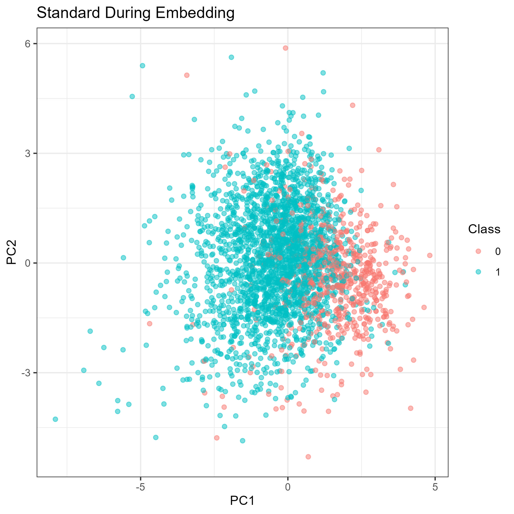
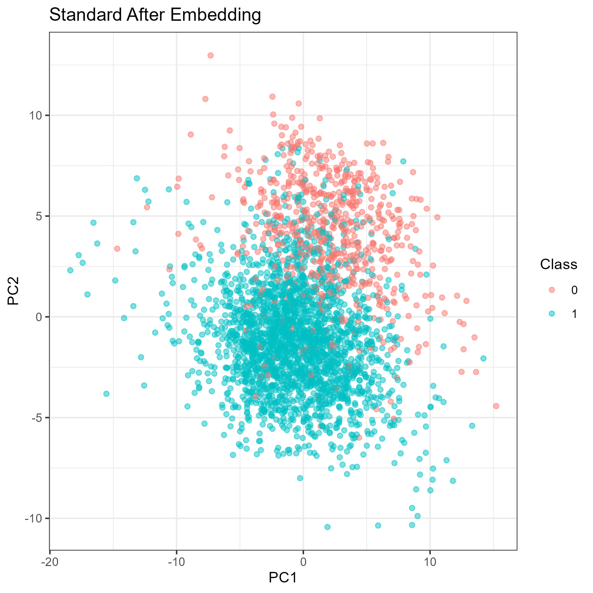
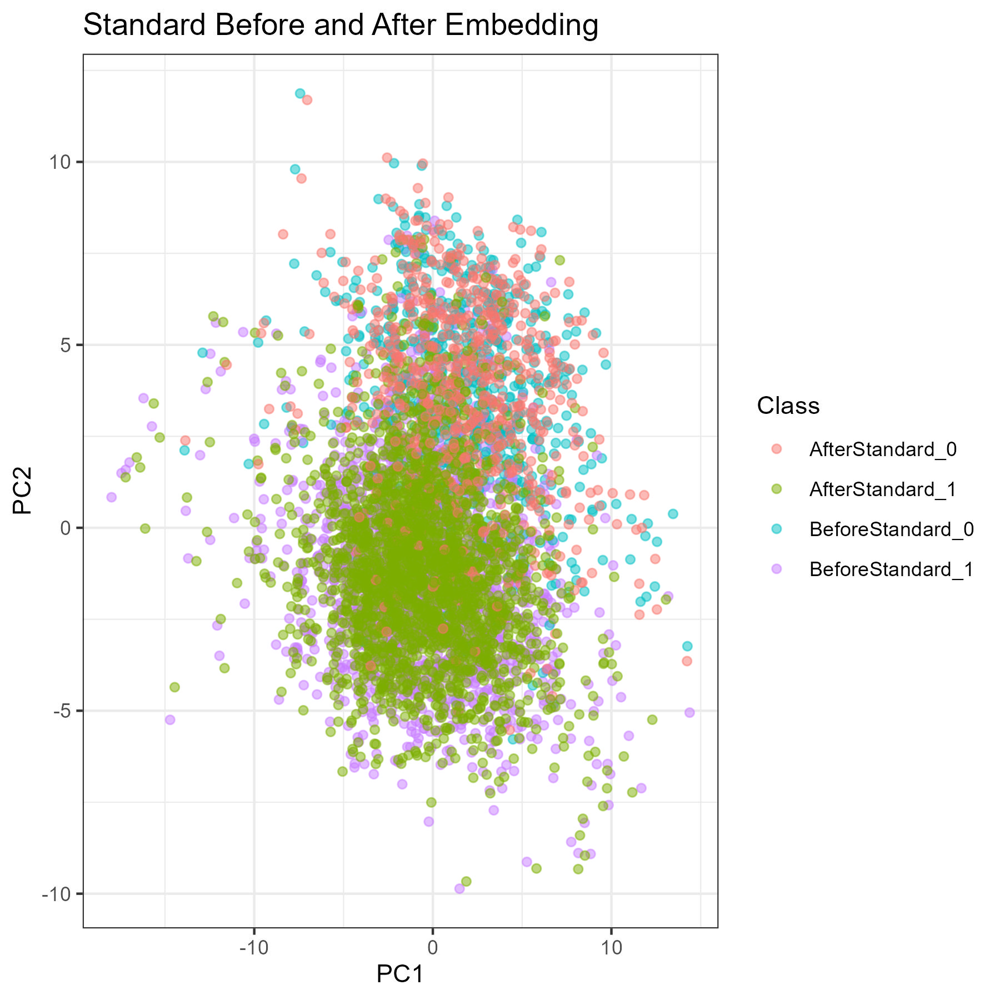

# Modifying the Network (Part 1)

- The results in this document come from the scripts run in [this folder](../scripts/12_Modifying_Network_Part_1)

# With Normalization
<!--{-->

## Optimizing the AutoEncoder
<!--{-->

| Layers | Function | Optimizer | Learning Rate | Embed Size | Dropout | Batch Size | Epochs | Val MAE |
|:---:|:---:|:---:|:---:|:---:|:---:|:---:|:---:|:---:|
| 6 | elu | adam | 0.001 | 10 | FALSE | 6 | 14 | 0.502 |
| 4 | elu | adam | 0.001 | 10 | FALSE | 6 | 14 | 0.499 |
| 2 | elu | adam | 0.001 | 10 | FALSE | 6 | 35 | 0.491 |
| 3 | elu | adam | 0.001 | 10 | FALSE | 6 | 18 | 0.495 |
| 3 | elu | adam | 0.001 | 10 | FALSE | 16 | 32 | 0.493 |
| 2 | elu | adam | 0.001 | 10 | FALSE | 16 | 53 | 0.49 |
| 2 | elu | adam | 0.001 | 10 | FALSE | 32 | 76 | 0.49 |
| 6 | elu | adam | 0.001 | 10 | FALSE | 32 | 25 | 0.499 |
| 6 | elu | adam | 0.001 | 10 | TRUE | 32 | 142 | 0.6 |
| 6 | elu | adam | 0.001 | 10 | TRUE | 6 | 55 | 0.608 |
| 10 | elu | adam | 0.001 | 10 | TRUE | 32 | 1 | 0.737 |
| 10 | elu | adam | 0.001 | 10 | FALSE | 32 | 37 | 0.518 |
| 10 | elu | adam | 1e-04 | 10 | FALSE | 32 | 266 | 0.51 |
| 10 | elu | adam | 2e-04 | 10 | FALSE | 32 | 122 | 0.511 |
| 6 | elu | adam | 2e-04 | 10 | FALSE | 32 | 92 | 0.498 |
| 2 | elu | adam | 2e-04 | 10 | FALSE | 32 | 350 | 0.491 |
| 2 | elu | adam | 0.002 | 10 | FALSE | 32 | 37 | 0.491 |
| 2 | elu | adam | 0.002 | 2 | FALSE | 32 | 34 | 0.619 |
| 2 | elu | adam | 0.002 | 5 | FALSE | 32 | 34 | 0.548 |
| 2 | elu | adam | 0.002 | 20 | FALSE | 32 | 72 | 0.427 |
| 2 | elu | adam | 2e-04 | 20 | FALSE | 32 | 500 | 0.422 |
| 2 | elu | adam | 2e-04 | 50 | FALSE | 32 | 773 | 0.278 |

<!--}-->

## AutoEncoder Results
<!--{-->

### Parameters

### Data Metrics

| Data set | Max | Min | Mean | Median | SD |
|:---:|:---:|:---:|:---:|:---:|:---:|
| Standard [Before] | 23.621 | -7.737 | 0 | -0.082 | 1 |
| Standard [During] | 17.256 | -17.332 | 0.011 | 0.186 | 2.823 |
| Standard [After] | 8.796 | -5.604 | 0.003 | 0.009 | 0.668 |

### Training Metrics

  Evaluating Validation set:
    - Validation Set MSE: 0.5633506
    - Validation set MAE: 0.5506819

  Evaluating Test set:
    - Test Set MSE: 0.5806342
    - Test set MAE: 0.5482115

### PCA Plots

| | Before | During | After |
|:---:|:---:|:---:|:---:|
| {width=100%} | {width=100%} | {width=100%} |

{width=100%}

<!--}-->

## Optimizing the Adversary Network
<!--{-->

| Data Set | Layers | DLayers | Units | ActFun | DActFun | Optimizer | Dropout | Batch Size | Epochs | Rel SD | Val Max | Val Accuracy |
|:---:|:---:|:---:|:---:|:---:|:---:|:---:|:---:|:---:|:---:|:---:|:---:|:---:|
| GSE25055 | 5 | 8 | 64 | elu | elu | adam | FALSE | 64 | 0 | 0.381 | 5.772 | 100 |

<!--}-->

## Results for GSE25055
<!--{-->

<!--}-->

## Results for GSE25065
<!--{-->

<!--}-->

## Results for GSE123845
<!--{-->

<!--}-->

## Results for Cross-Set Prediction
<!--{-->

<!--}-->

<!--}-->

# Without Normalization
<!--{-->

## AutoEncoder Results
<!--{-->

<!--}-->

<!--}-->

