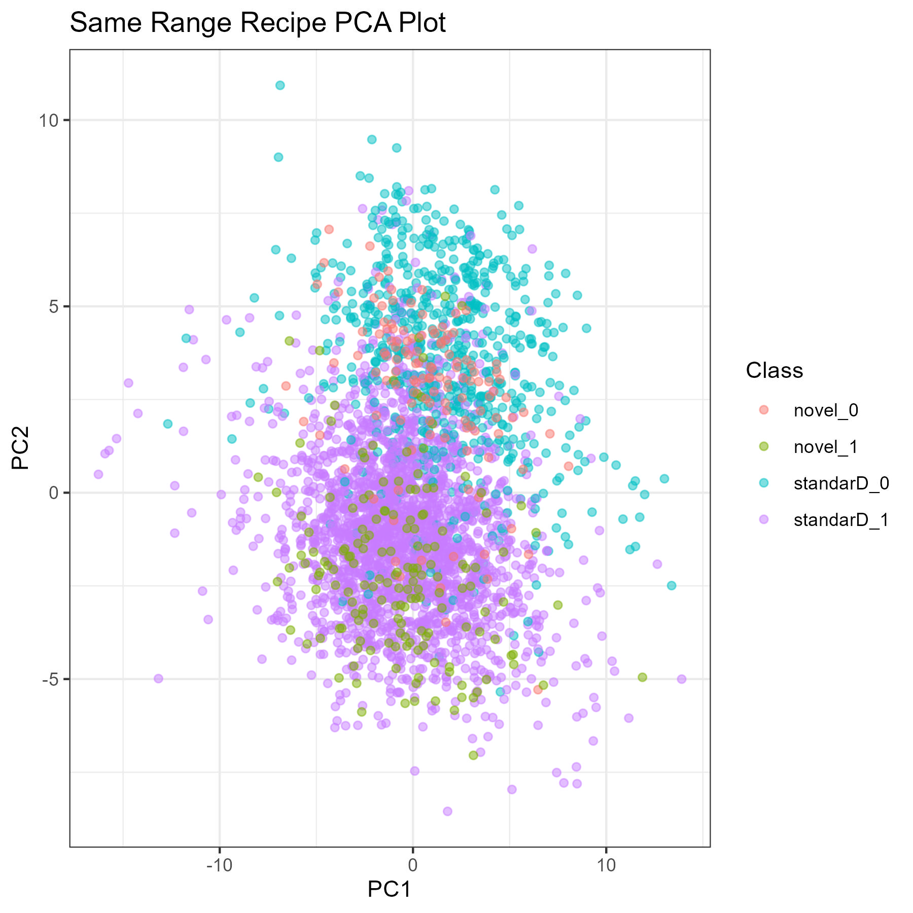
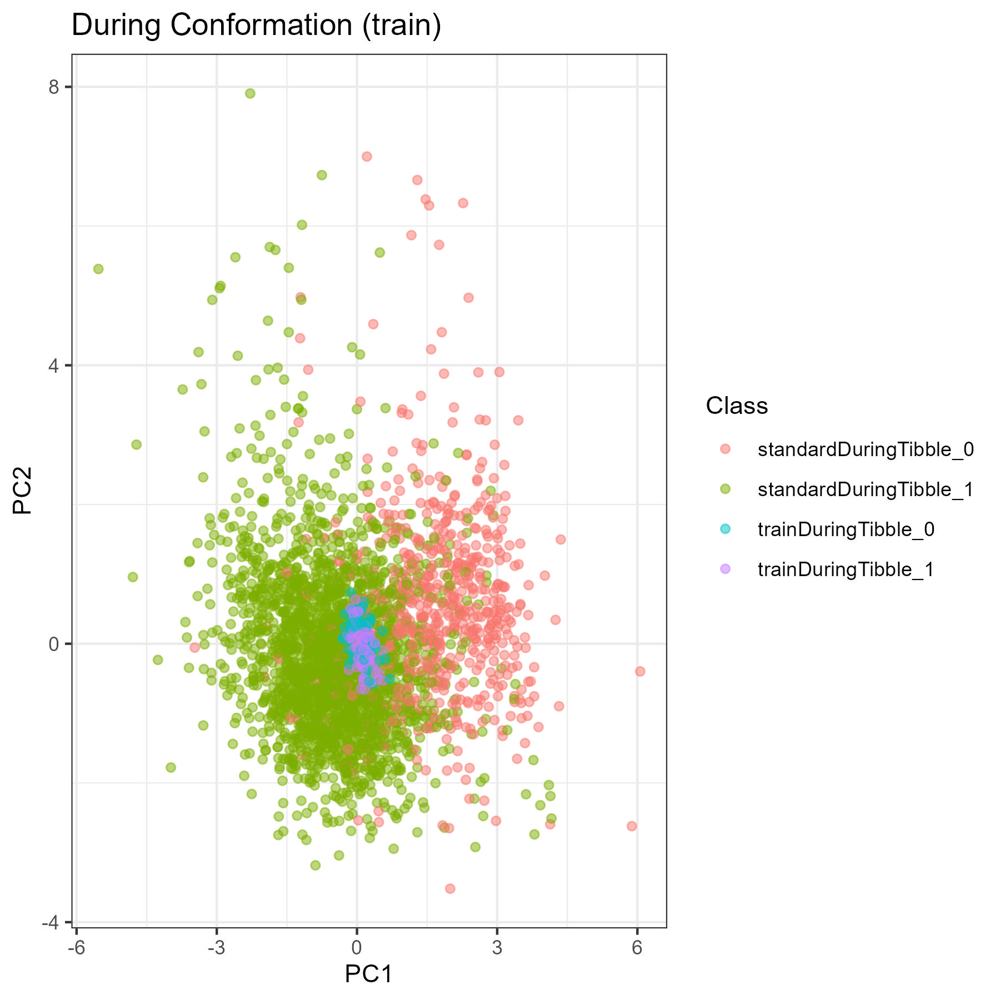
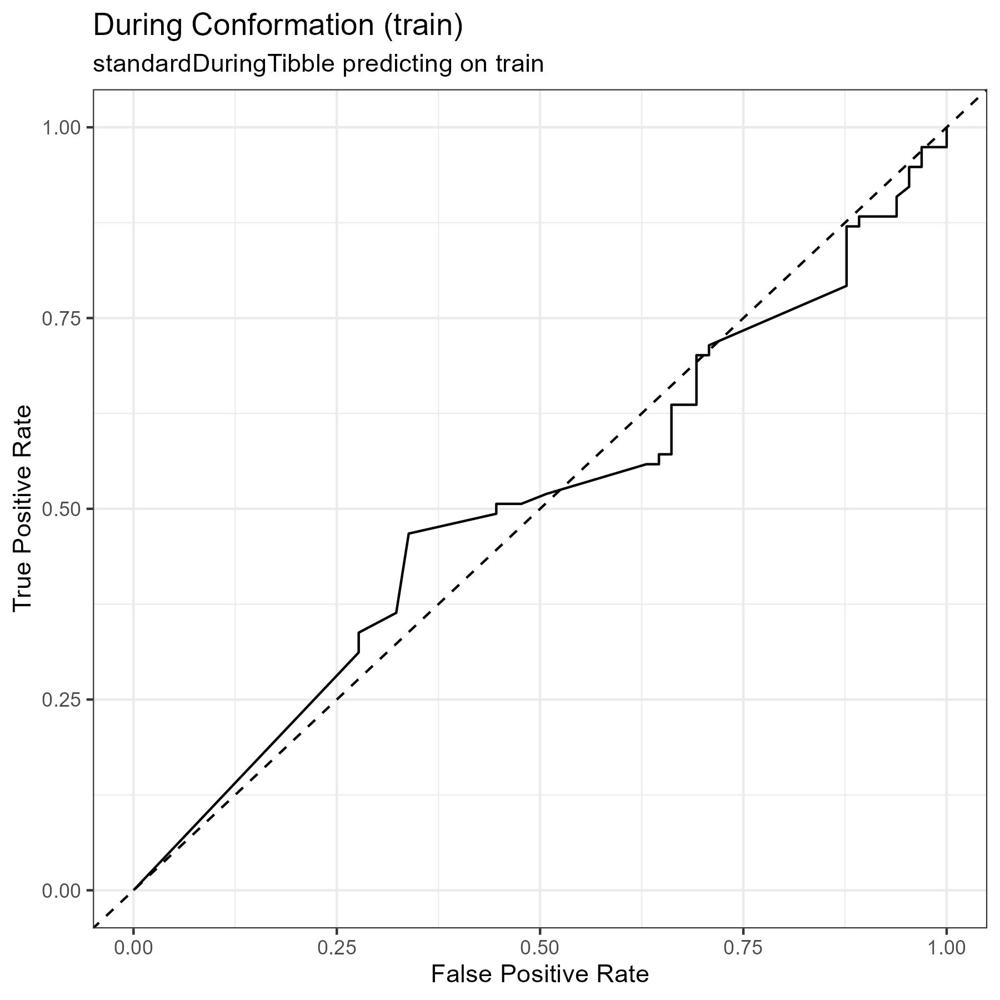
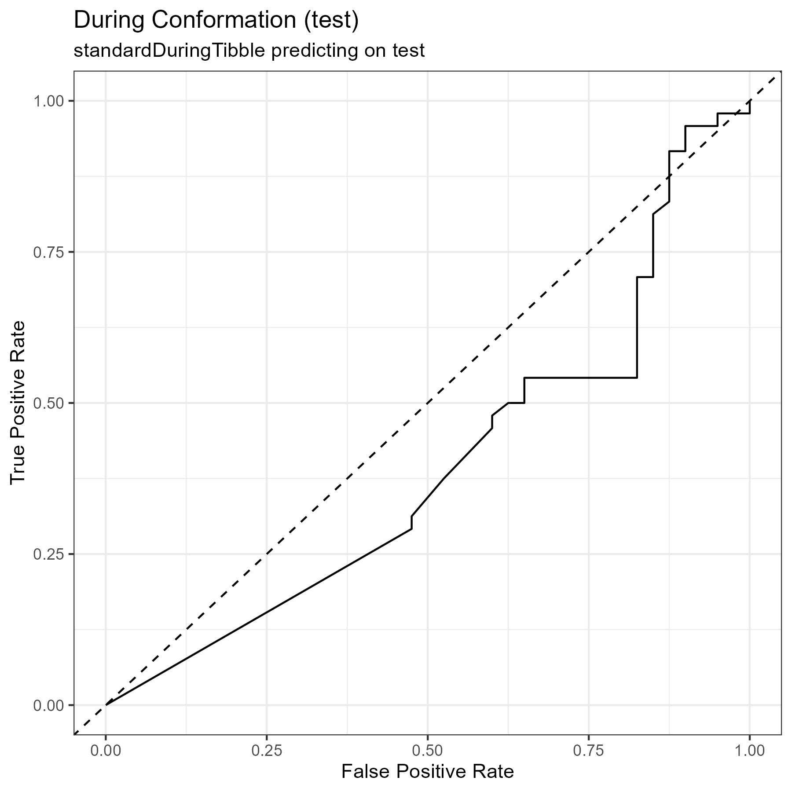
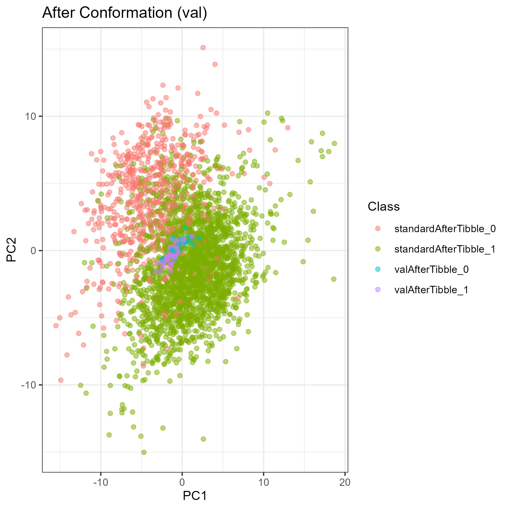

# Modifying the Network (Part 1)

- The results in this document come from the scripts run in [this folder](../scripts/12_Modifying_Network_Part_1)

# With Normalization
<!--{-->

## Optimizing the AutoEncoder
<!--{-->

| Layers | Function | Optimizer | Learning Rate | Embed Size | Dropout | Batch Size | Epochs | Val MAE |
|:---:|:---:|:---:|:---:|:---:|:---:|:---:|:---:|:---:|
| 6 | elu | adam | 0.001 | 10 | FALSE | 6 | 14 | 0.502 |
| 4 | elu | adam | 0.001 | 10 | FALSE | 6 | 14 | 0.499 |
| 2 | elu | adam | 0.001 | 10 | FALSE | 6 | 35 | 0.491 |
| 3 | elu | adam | 0.001 | 10 | FALSE | 6 | 18 | 0.495 |
| 3 | elu | adam | 0.001 | 10 | FALSE | 16 | 32 | 0.493 |
| 2 | elu | adam | 0.001 | 10 | FALSE | 16 | 53 | 0.49 |
| 2 | elu | adam | 0.001 | 10 | FALSE | 32 | 76 | 0.49 |
| 6 | elu | adam | 0.001 | 10 | FALSE | 32 | 25 | 0.499 |
| 6 | elu | adam | 0.001 | 10 | TRUE | 32 | 142 | 0.6 |
| 6 | elu | adam | 0.001 | 10 | TRUE | 6 | 55 | 0.608 |
| 10 | elu | adam | 0.001 | 10 | TRUE | 32 | 1 | 0.737 |
| 10 | elu | adam | 0.001 | 10 | FALSE | 32 | 37 | 0.518 |
| 10 | elu | adam | 1e-04 | 10 | FALSE | 32 | 266 | 0.51 |
| 10 | elu | adam | 2e-04 | 10 | FALSE | 32 | 122 | 0.511 |
| 6 | elu | adam | 2e-04 | 10 | FALSE | 32 | 92 | 0.498 |
| 2 | elu | adam | 2e-04 | 10 | FALSE | 32 | 350 | 0.491 |
| 2 | elu | adam | 0.002 | 10 | FALSE | 32 | 37 | 0.491 |
| 2 | elu | adam | 0.002 | 2 | FALSE | 32 | 34 | 0.619 |
| 2 | elu | adam | 0.002 | 5 | FALSE | 32 | 34 | 0.548 |
| 2 | elu | adam | 0.002 | 20 | FALSE | 32 | 72 | 0.427 |
| 2 | elu | adam | 2e-04 | 20 | FALSE | 32 | 500 | 0.422 |
| 2 | elu | adam | 2e-04 | 50 | FALSE | 32 | 773 | 0.278 |
| 2 | elu | adam | 0.002 | 30 | FALSE | 32 | 98 | 0.375 |
| 2 | elu | adam | 0.002 | 40 | FALSE | 32 | 55 | 0.329 |
| 2 | elu | adam | 0.002 | 100 | FALSE | 32 | 145 | 0.07 |
| 1 | elu | adam | 0.002 | 100 | FALSE | 32 | 196 | 0.14 |
| 3 | elu | adam | 0.002 | 100 | FALSE | 32 | 196 | 0.14 |
| 5 | elu | adam | 0.002 | 100 | FALSE | 32 | 197 | 0.281 |

<!--}-->

## AutoEncoder Results
<!--{-->

### Parameters

### Data Metrics

| Data set | Max | Min | Mean | Median | SD |
|:---:|:---:|:---:|:---:|:---:|:---:|
| Standard [Before] | 23.621 | -7.737 | 0 | -0.082 | 1 |
| Standard [During] | 17.256 | -17.332 | 0.011 | 0.186 | 2.823 |
| Standard [After] | 8.796 | -5.604 | 0.003 | 0.009 | 0.668 |

### Training Metrics

  Evaluating Validation set:
    - Validation Set MSE: 0.5633506
    - Validation set MAE: 0.5506819

  Evaluating Test set:
    - Test Set MSE: 0.5806342
    - Test set MAE: 0.5482115

### PCA Plots

| | Before | During | After |
|:---:|:---:|:---:|:---:|
| {width=100%} | {width=100%} | {width=100%} |

{width=100%}

<!--}-->

## Optimizing the Adversary Network
<!--{-->

| Data Set | Layers | DLayers | Units | ActFun | DActFun | Optimizer | Dropout | Batch Size | Epochs | Rel SD | Val Max | Val Accuracy |
|:---:|:---:|:---:|:---:|:---:|:---:|:---:|:---:|:---:|:---:|:---:|:---:|:---:|
| GSE25055 | 5 | 8 | 64 | elu | elu | adam | FALSE | 64 | 0 | 0.381 | 5.772 | 100 |
| GSE25055 | 8 | 8 | 64 | elu | elu | adam | FALSE | 64 | 120 | 0.349 | 4.394 | 1.6 |
| GSE25055 | 2 | 8 | 64 | elu | elu | adam | FALSE | 64 | 120 | 0.466 | 4.845 | 0 |
| GSE25055 | 2 | 8 | 64 | elu | elu | adam | FALSE | 64 | 230 | 0.287 | 3.515 | 4.6 |
| GSE25055 | 2 | 8 | 64 | elu | elu | adam | FALSE | 64 | 310 | 0.266 | 3.28 | 7 |
| GSE25055 | 2 | 10 | 64 | elu | elu | adam | FALSE | 64 | 340 | 0.252 | 3.672 | 2.5 |
| GSE25055 | 2 | 10 | 64 | elu | elu | adam | FALSE | 64 | 490 | 0.195 | 4.12 | 8 |
| GSE25055 | 3 | 10 | 64 | elu | elu | adam | FALSE | 64 | 60 | 0.211 | 2.163 | 53.9 |
| GSE25055 | 6 | 10 | 64 | elu | elu | adam | FALSE | 64 | 120 | 0.323 | 3.097 | 33.8 |
| GSE25055 | 8 | 10 | 64 | elu | elu | adam | FALSE | 64 | 50 | 0.255 | 3.666 | 46.6 |
| GSE25055 | 6 | 4 | 32 | elu | elu | adam | TRUE | 64 | 410 | 0.273 | 4.499 | 87.4 |

<!--}-->

## Results for GSE25055
<!--{-->

| Plot Type | Standard Recipe | Novel Recipe |
|:---:|:---:|:---:|
| ROC | {#plot-1 width=100%} | {#plot-2 width=100%} |
| PCA | {width=100%} | {width=100%} |

  Stats:
    - Accuracy:     0.863
    - ROC AUC:     0.936

  Stats Each Recipe:
    - Accuracy:     0.863
    - ROC AUC:     0.936

Preparing Model:     0.229 s

Training:

Trained in 11.255 m

## Data Metrics

| Data Set | Max | Min | Mean | Median | SD |
|:---:|:---:|:---:|:---:|:---:|:---:|
| standard [Before] | 23.621 | -7.737 | 0 | -0.082 | 1 |
| train [Before] | 4.346 | -3.958 | -0.042 | -0.119 | 0.983 |
| val [Before] | 5.178 | -3.332 | 0.07 | 0.009 | 1.041 |
| test [Before] | 4.989 | -5.576 | 0.019 | -0.027 | 0.99 |
| standard [During] | 7.43 | -5.929 | 0.057 | 0.043 | 0.89 |
| train [During] | 3.768 | -3.845 | 0.038 | 0.023 | 0.852 |
| val [During] | 3.347 | -2.866 | 0.037 | 0.053 | 0.874 |
| test [During] | 3.291 | -5.039 | 0.041 | 0.034 | 0.844 |
| standard [After] | 18.599 | -5.724 | 0.002 | -0.031 | 0.897 |
| train [After] | 3.628 | -3.615 | 0.064 | 0.068 | 0.826 |
| val [After] | 3.902 | -3.442 | 0.016 | 0.021 | 0.85 |
| test [After] | 4.077 | -3.062 | 0.055 | 0.042 | 0.817 |

  Baking standardBeforeTibble     ( 1 / 4 )    0.025 s
  Baking trainBeforeTibble     ( 2 / 4 )    0.030 s
  Baking valBeforeTibble     ( 3 / 4 )    0.028 s
  Baking testBeforeTibble     ( 4 / 4 )    0.029 s

 {width=100%} |
 {#plot-0 width=100%} |

#### Before Conformation (train) Confusion Matrix

|   Predicted/Actual    |   +   |   -   |
| :-------------------: | :---: | :---: |
|           +           |  72  |  20  |
|           -           |  5  |  45  |

#### Before Conformation (train) Metrics

- Accuracy:     0.824
- Precision:    0.783
- Recall:       0.935
- Specificity:  0.692

 {width=100%} |
 {#plot-0 width=100%} |

#### Before Conformation (val) Confusion Matrix

|   Predicted/Actual    |   +   |   -   |
| :-------------------: | :---: | :---: |
|           +           |  40  |  4  |
|           -           |  1  |  16  |

#### Before Conformation (val) Metrics

- Accuracy:     0.918
- Precision:    0.909
- Recall:       0.976
- Specificity:  0.8

 {width=100%} |
 {#plot-0 width=100%} |

#### Before Conformation (test) Confusion Matrix

|   Predicted/Actual    |   +   |   -   |
| :-------------------: | :---: | :---: |
|           +           |  46  |  8  |
|           -           |  2  |  32  |

#### Before Conformation (test) Metrics

- Accuracy:     0.886
- Precision:    0.852
- Recall:       0.958
- Specificity:  0.8

  Baking standardDuringTibble     ( 1 / 4 )    0.015 s
  Baking trainDuringTibble     ( 2 / 4 )    0.019 s
  Baking valDuringTibble     ( 3 / 4 )    0.015 s
  Baking testDuringTibble     ( 4 / 4 )    0.011 s

 {width=100%} |
 {#plot-0 width=100%} |

#### During Conformation (train) Confusion Matrix

|   Predicted/Actual    |   +   |   -   |
| :-------------------: | :---: | :---: |
|           +           |  66  |  59  |
|           -           |  11  |  6  |

#### During Conformation (train) Metrics

- Accuracy:     0.507
- Precision:    0.528
- Recall:       0.857
- Specificity:  0.092

 {width=100%} |
 {#plot-0 width=100%} |

#### During Conformation (val) Confusion Matrix

|   Predicted/Actual    |   +   |   -   |
| :-------------------: | :---: | :---: |
|           +           |  37  |  20  |
|           -           |  4  |  0  |

#### During Conformation (val) Metrics

- Accuracy:     0.607
- Precision:    0.649
- Recall:       0.902
- Specificity:  0

 {width=100%} |
 {#plot-0 width=100%} |

#### During Conformation (test) Confusion Matrix

|   Predicted/Actual    |   +   |   -   |
| :-------------------: | :---: | :---: |
|           +           |  45  |  37  |
|           -           |  3  |  3  |

#### During Conformation (test) Metrics

- Accuracy:     0.545
- Precision:    0.549
- Recall:       0.938
- Specificity:  0.075

  Baking standardAfterTibble     ( 1 / 4 )    0.014 s
  Baking trainAfterTibble     ( 2 / 4 )    0.018 s
  Baking valAfterTibble     ( 3 / 4 )    0.022 s
  Baking testAfterTibble     ( 4 / 4 )    0.024 s

 {width=100%} |
 {#plot-0 width=100%} |

#### After Conformation (train) Confusion Matrix

|   Predicted/Actual    |   +   |   -   |
| :-------------------: | :---: | :---: |
|           +           |  68  |  57  |
|           -           |  9  |  8  |

#### After Conformation (train) Metrics

- Accuracy:     0.535
- Precision:    0.544
- Recall:       0.883
- Specificity:  0.123

 {width=100%} |
 {#plot-0 width=100%} |

#### After Conformation (val) Confusion Matrix

|   Predicted/Actual    |   +   |   -   |
| :-------------------: | :---: | :---: |
|           +           |  36  |  20  |
|           -           |  5  |  0  |

#### After Conformation (val) Metrics

- Accuracy:     0.59
- Precision:    0.643
- Recall:       0.878
- Specificity:  0

 {width=100%} |
 {#plot-0 width=100%} |

#### After Conformation (test) Confusion Matrix

|   Predicted/Actual    |   +   |   -   |
| :-------------------: | :---: | :---: |
|           +           |  44  |  37  |
|           -           |  4  |  3  |

#### After Conformation (test) Metrics

- Accuracy:     0.534
- Precision:    0.543
- Recall:       0.917
- Specificity:  0.075

## Data Metrics

| Data Set | Max | Min | Mean | Median | SD |
|:---:|:---:|:---:|:---:|:---:|:---:|
| standard [Before] | 23.621 | -7.737 | 0 | -0.082 | 1 |
| train [Before] | 4.346 | -3.958 | -0.042 | -0.119 | 0.983 |
| val [Before] | 5.178 | -3.332 | 0.07 | 0.009 | 1.041 |
| test [Before] | 4.989 | -5.576 | 0.019 | -0.027 | 0.99 |
| standard [During] | 8.041 | -7.143 | 0.017 | 0.032 | 0.999 |
| train [During] | 3.598 | -2.756 | 0.038 | 0.032 | 0.921 |
| val [During] | 4.35 | -2.705 | 0.032 | 0.019 | 0.909 |
| test [During] | 3.549 | -2.634 | 0.052 | 0.054 | 0.877 |
| standard [After] | 18.784 | -5.544 | 0.001 | -0.032 | 0.875 |
| train [After] | 2.828 | -2.629 | 0.06 | 0.048 | 0.73 |
| val [After] | 3.383 | -2.26 | 0.091 | 0.064 | 0.71 |
| test [After] | 2.46 | -2.399 | 0.065 | 0.061 | 0.693 |

  Baking standardBeforeTibble 	( 1 / 4 )	0.034 s
  Baking trainBeforeTibble 	( 2 / 4 )	0.021 s
  Baking valBeforeTibble 	( 3 / 4 )	0.026 s
  Baking testBeforeTibble 	( 4 / 4 )	0.020 s

 {width=100%} |
 {#plot-0 width=100%} |

#### Before Conformation (train) Confusion Matrix

|   Predicted/Actual    |   +   |   -   |
| :-------------------: | :---: | :---: |
|           +           |  72  |  20  |
|           -           |  5  |  45  |

#### Before Conformation (train) Metrics

- Accuracy:     0.824
- Precision:    0.783
- Recall:       0.935
- Specificity:  0.692

 {width=100%} |
 {#plot-0 width=100%} |

#### Before Conformation (val) Confusion Matrix

|   Predicted/Actual    |   +   |   -   |
| :-------------------: | :---: | :---: |
|           +           |  40  |  4  |
|           -           |  1  |  16  |

#### Before Conformation (val) Metrics

- Accuracy:     0.918
- Precision:    0.909
- Recall:       0.976
- Specificity:  0.8

 {width=100%} |
 {#plot-0 width=100%} |

#### Before Conformation (test) Confusion Matrix

|   Predicted/Actual    |   +   |   -   |
| :-------------------: | :---: | :---: |
|           +           |  46  |  8  |
|           -           |  2  |  32  |

#### Before Conformation (test) Metrics

- Accuracy:     0.886
- Precision:    0.852
- Recall:       0.958
- Specificity:  0.8

  Baking standardDuringTibble 	( 1 / 4 )	0.010 s
  Baking trainDuringTibble 	( 2 / 4 )	0.011 s
  Baking valDuringTibble 	( 3 / 4 )	0.013 s
  Baking testDuringTibble 	( 4 / 4 )	0.010 s

 {width=100%} |
 {#plot-0 width=100%} |

#### During Conformation (train) Confusion Matrix

|   Predicted/Actual    |   +   |   -   |
| :-------------------: | :---: | :---: |
|           +           |  76  |  65  |
|           -           |  1  |  0  |

#### During Conformation (train) Metrics

- Accuracy:     0.535
- Precision:    0.539
- Recall:       0.987
- Specificity:  0

 {width=100%} |
 {#plot-0 width=100%} |

#### During Conformation (val) Confusion Matrix

|   Predicted/Actual    |   +   |   -   |
| :-------------------: | :---: | :---: |
|           +           |  39  |  20  |
|           -           |  2  |  0  |

#### During Conformation (val) Metrics

- Accuracy:     0.639
- Precision:    0.661
- Recall:       0.951
- Specificity:  0

 {width=100%} |
 {#plot-0 width=100%} |

#### During Conformation (test) Confusion Matrix

|   Predicted/Actual    |   +   |   -   |
| :-------------------: | :---: | :---: |
|           +           |  47  |  40  |
|           -           |  1  |  0  |

#### During Conformation (test) Metrics

- Accuracy:     0.534
- Precision:    0.54
- Recall:       0.979
- Specificity:  0

  Baking standardAfterTibble 	( 1 / 4 )	0.015 s
  Baking trainAfterTibble 	( 2 / 4 )	0.016 s
  Baking valAfterTibble 	( 3 / 4 )	0.015 s
  Baking testAfterTibble 	( 4 / 4 )	0.015 s

 {width=100%} |
 {#plot-0 width=100%} |

#### After Conformation (train) Confusion Matrix

|   Predicted/Actual    |   +   |   -   |
| :-------------------: | :---: | :---: |
|           +           |  77  |  65  |
|           -           |  0  |  0  |

#### After Conformation (train) Metrics

- Accuracy:     0.542
- Precision:    0.542
- Recall:       1
- Specificity:  0

 {width=100%} |
 {#plot-0 width=100%} |

#### After Conformation (val) Confusion Matrix

|   Predicted/Actual    |   +   |   -   |
| :-------------------: | :---: | :---: |
|           +           |  41  |  20  |
|           -           |  0  |  0  |

#### After Conformation (val) Metrics

- Accuracy:     0.672
- Precision:    0.672
- Recall:       1
- Specificity:  0

 {width=100%} |
 {#plot-0 width=100%} |

#### After Conformation (test) Confusion Matrix

|   Predicted/Actual    |   +   |   -   |
| :-------------------: | :---: | :---: |
|           +           |  48  |  40  |
|           -           |  0  |  0  |

#### After Conformation (test) Metrics

- Accuracy:     0.545
- Precision:    0.545
- Recall:       1
- Specificity:  0

<!--}-->

## Results for GSE25065
<!--{-->

<!--}-->

## Results for GSE123845
<!--{-->

<!--}-->

## Results for Cross-Set Prediction
<!--{-->

<!--}-->

<!--}-->

# Without Normalization
<!--{-->

## AutoEncoder Results
<!--{-->

<!--}-->

<!--}-->

