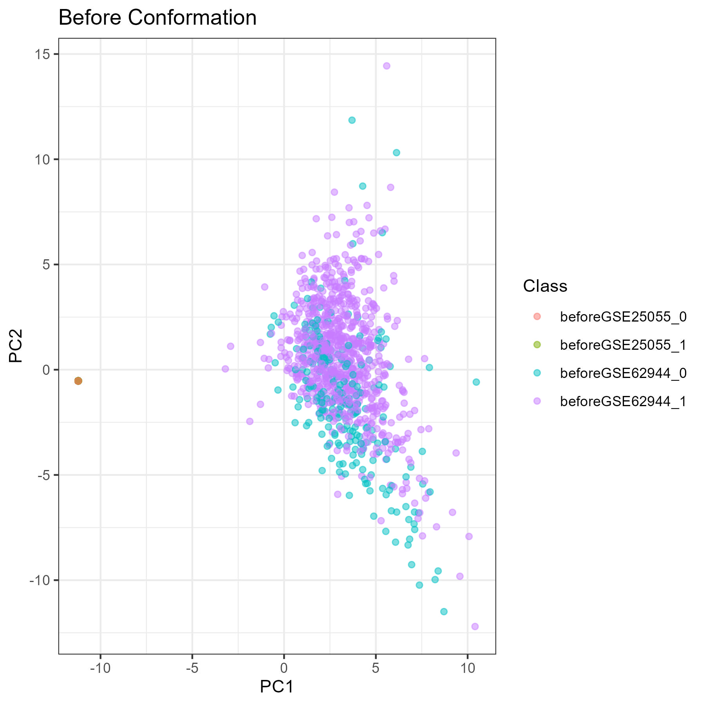
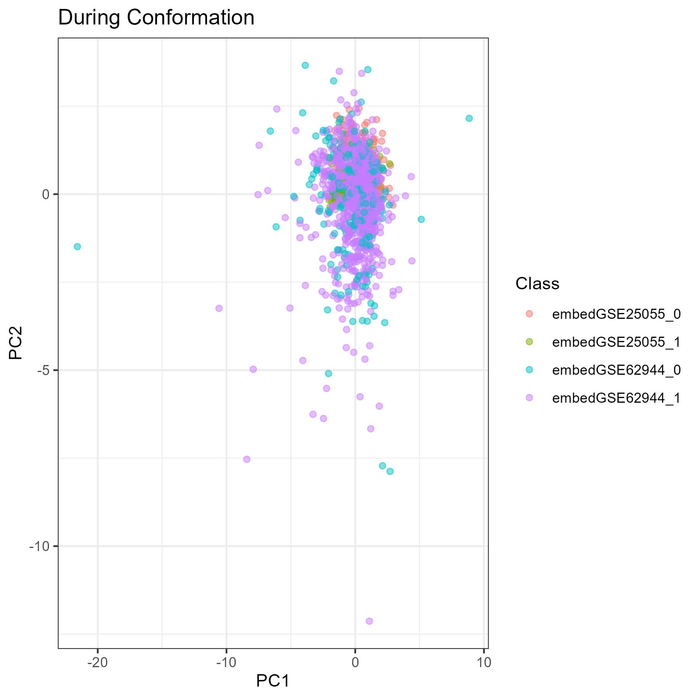
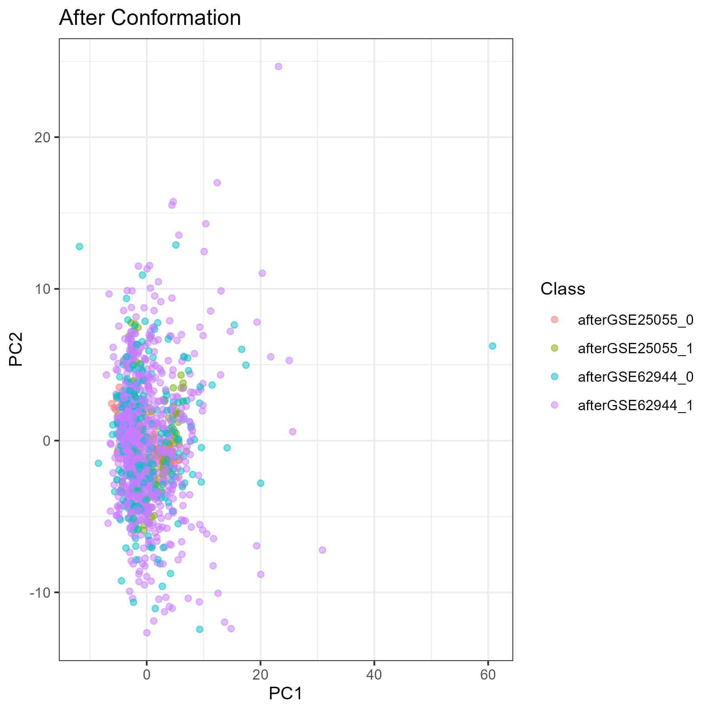
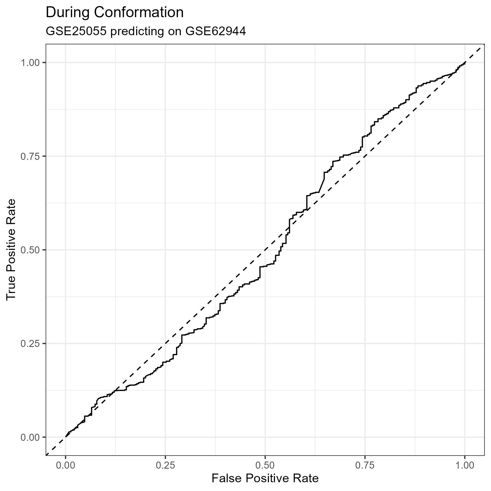
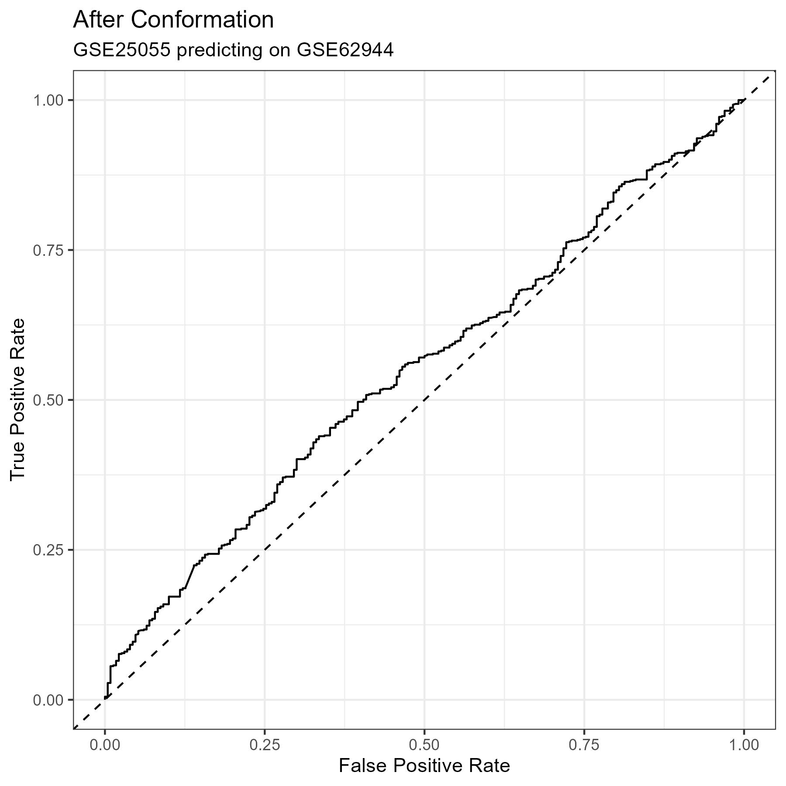

{width=100%}

{width=100%}

{width=100%}

#### Before Conformation Confusion Matrix {#matrix-1} 

|   Predicted/Actual    |   +   |   -   |
| :-------------------: | :---: | :---: |
|           +           |  10  |  36  |
|           -           |  775  |  194  |

#### Before Conformation Metrics {#metrics-1} 

- Accuracy:     0.201 
- Precision:    0.217 
- Recall:       0.013 
- Specificity:  0.843 

#### During Conformation Confusion Matrix {#matrix-2} 

|   Predicted/Actual    |   +   |   -   |
| :-------------------: | :---: | :---: |
|           +           |  726  |  202  |
|           -           |  59  |  28  |

#### During Conformation Metrics {#metrics-2} 

- Accuracy:     0.743 
- Precision:    0.782 
- Recall:       0.925 
- Specificity:  0.122 

#### After Conformation Confusion Matrix {#matrix-3} 

|   Predicted/Actual    |   +   |   -   |
| :-------------------: | :---: | :---: |
|           +           |  680  |  190  |
|           -           |  105  |  40  |

#### After Conformation Metrics {#metrics-3} 

- Accuracy:     0.709 
- Precision:    0.782 
- Recall:       0.866 
- Specificity:  0.174 

{#plot-1 width=100%}

{#plot-2 width=100%}

{#plot-1 width=100%}
